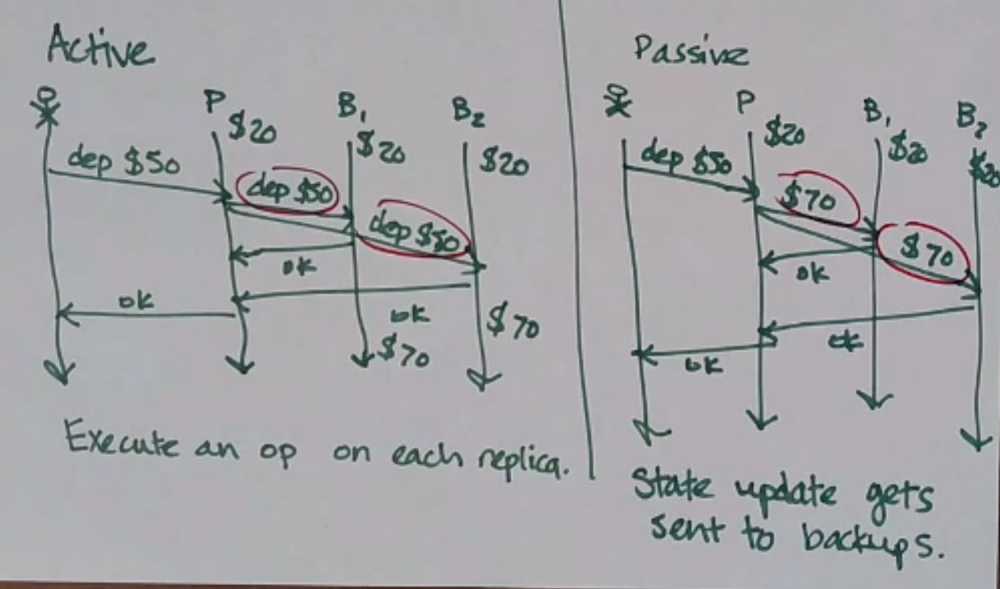

Active v. Passive Replication
=============================

- Active replication: execute an operate on each replica (aka state machine replication)
- Passive replication: state gets sent to backups

Example (primary-backup replication):

You might choose one over the other for the following reasons:

- the updated state might be large (use active)
- an operation might be expensive to do on each replica (use passive)
- the operation might depend on local process state (use passive)
