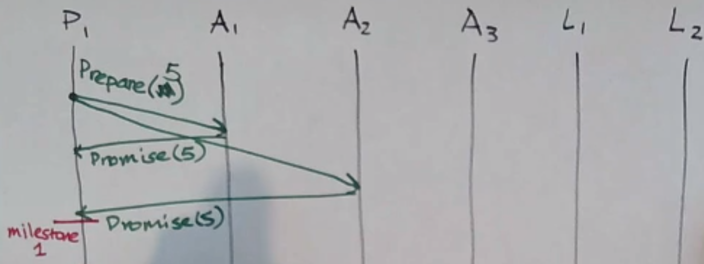
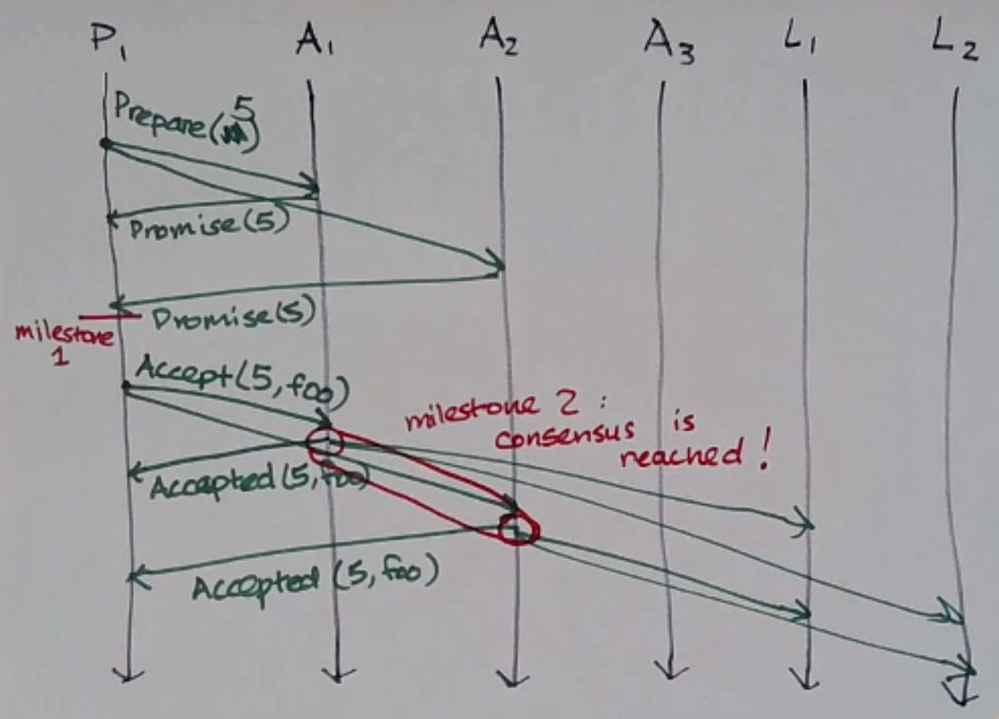
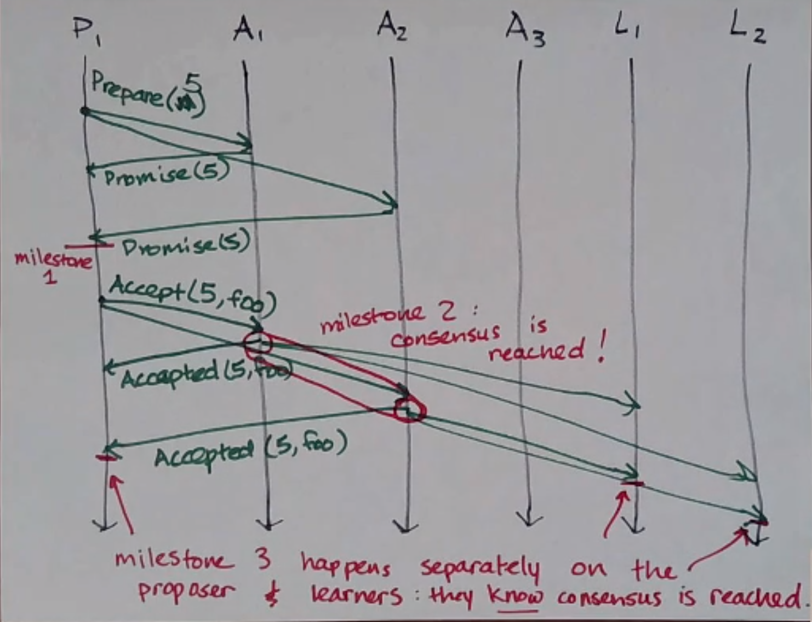
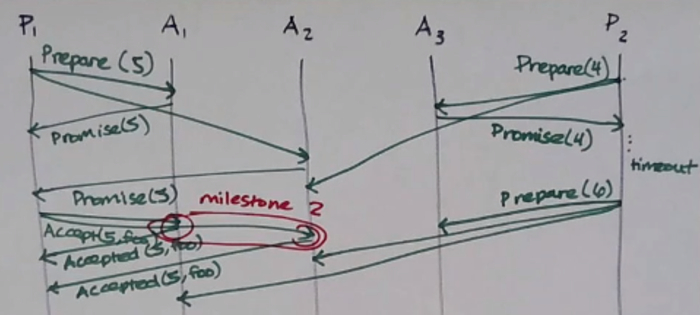
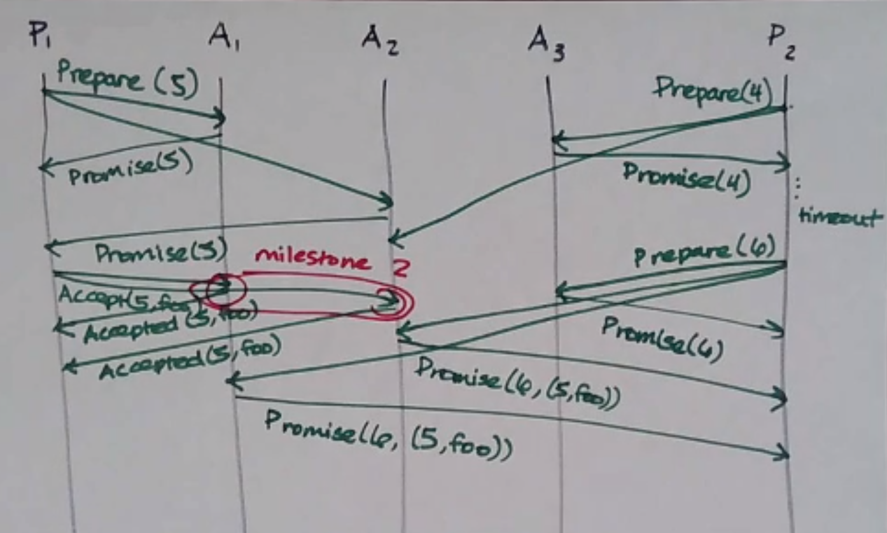
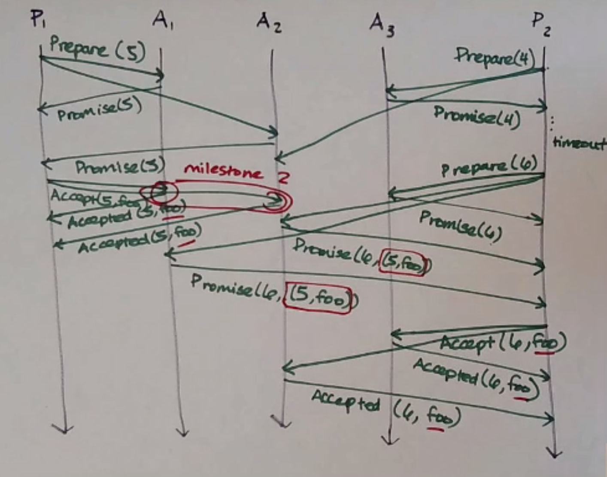

Consensus
=========
Consensus is *hard*.

When do you need it? When you have a bunch of processes, and...

- they need to deliver the same messages, in the same order (**totally-ordered/atomic broadcast**)
- they need to each know what other processes exist, and keep those lists up to date
  (**group membership problem, failure detection**)
- one of them needs to play a particular specific role and the others need to agree who that is (**leader election**)
- they need to be able to take turns accessing a resource that only one can access at a time
  (**mutual exclusion problem**)
- they're participating in a transaction and need to agree on a commit/abort decision
  (**distributed transaction commit**)

We can view consensus as a kind of box, with multiple inputs going in and coming out; the inputs might differ,
but in a correct system, they agree coming out.

Properties
----------
Consensus algorithms try to satisfy the following properties:

- **termination**: each correct process eventually decides on a value (whatever it is)
- **agreement**: all correct processes decide on the *same* value
- **validity** (aka integrity, nontriviality): the agreed-upon value must be one of the proposed values

.. note::
    In the asynchronous network + crash fault model, no algorithm actually satisfies all 3 of these
    (Fischer, Lynch, Paterson, 1983)! In this model, we have to compromise, and usually it's termination
    that we compromise on.

Paxos
-----
*Leslie Lamport, 1998*

Each process takes on some of 3 roles:

- **proposer** - proposes values
- **acceptor** - contribute to choosing from among the proposed values
- **learner** - learns the agreed-upon value

A process could take on multiple roles, but we usually examine the case where each process only takes on one.
Each process that plays any role is called a *Paxos node*.

Paxos nodes must:

- persist data
- know how many nodes is a majority of acceptors

How it Works
^^^^^^^^^^^^

**Phase 1**

- proposer: sends a prepare message with a unique proposal number to a majority of acceptors, ``Prepare(n)``
    - the proposal number *n* must be unique, and higher than any proposal number that *this* proposer has used before
- acceptor: upon receiving a ``Prepare(n)`` message, check: "did I previously promise to ignore requests with this
  proposal number?"
    - if so, ignore the message
    - otherwise, promise to ignore requests with proposal number < *n*, and reply with ``Promise(n)`` (*)
        - ``Promise(n)``: "I will ignore any request with a proposal number < n"
        - when a majority reply with a promise, we reach a milestone: it is impossible to get a majority to promise
          anything lower than *n*

**Phase 2** - the proposer has received ``Promise(n)`` from a majority of acceptors (for some *n*)

- proposer: send an ``Accept(n, val)`` message to at least a majority of acceptors, where:
    - *n* is the proposal number that was promised
    - *val* is the actual value it wants to propose (**)
- acceptor: upon receiving an ``Accept(n, val)`` message, check if it previously promised to ignore requests with *n*
    - if so, ignore the message
    - otherwise, reply with ``Accepted(n, val)``, and also sends ``Accepted(n, val)`` to all *learners*
        - when the majority of acceptors have sent an ``Accepted(n, val)`` message for a given *n*, we reach a
          milestone: we have consensus on *val* (but no one knows)

When each participant receives ``Accepted`` from a majority of acceptors, then they know consensus is reached
(this happens separately on the proposer and learners)

Getting Weird
^^^^^^^^^^^^^
Consider the following execution:

- P1 sends ``Prepare(5)``
- P2 sends ``Prepare(4)``
    - it doesn't receive ``Promise``s in time, so it tries again with a higher proposal number
- P1 sends ``Accept(5, foo)`` and the acceptors send ``Accepted(5, foo)`` at the same time P2 sends ``Prepare(6)``
- oh no!

So we have to change what happens in phase 1:

- acceptor: upon receiving a ``Prepare(n)`` message, check: "did I previously promise to ignore requests with this
  proposal number?"
    - if so, ignore the message
    - otherwise, **check if it has previously accepted anything**
        - if so, reply with ``Promise(n, (n_prev, val_prev))``, where ``n_prev`` is the highest previously-accepted
          proposal number and ``val_prev`` is the previously accepted proposed value
        - otherwise, reply with ``Promise(n)``

Now, in phase 2, the proposer has to do something different having received ``Promise(n)`` *or*
``Promise(n, (n_prev, val_prev))`` from a majority of acceptors:

- proposer: send an ``Accept(n, val)`` message to at least a majority of acceptors, where:
    - *n* is the proposal number that was promised
    - *val* is **chosen as follows**:
        - the ``val_prev`` corresponding to the highest ``n_prev``
        - or the value it wants, if no ``n_prev`` info was received

Final Algorithm
^^^^^^^^^^^^^^^

**Phase 1**

- proposer: sends a prepare message with a unique proposal number to a majority of acceptors, ``Prepare(n)``
    - the proposal number *n* must be unique, and higher than any proposal number that *this* proposer has used before
- acceptor: upon receiving a ``Prepare(n)`` message, check: "did I previously promise to ignore requests with this
  proposal number?"
    - if so, ignore the message
    - otherwise, check if it has previously accepted anything
        - if so, reply with ``Promise(n, (n_prev, val_prev))``, where ``n_prev`` is the highest previously-accepted
          proposal number and ``val_prev`` is the previously accepted proposed value
        - otherwise, reply with ``Promise(n)``

**Phase 2** - the proposer has received ``Promise(n)`` or ``Promise(n, (n_prev, val_prev))`` from a majority of
acceptors (for some *n*)

- proposer: send an ``Accept(n, val)`` message to at least a majority of acceptors, where:
    - *n* is the proposal number that was promised
    - *val* is chosen as follows:
        - the ``val_prev`` corresponding to the highest ``n_prev``
        - or the value it wants, if no ``n_prev`` info was received
- acceptor: upon receiving an ``Accept(n, val)`` message, check if it previously promised to ignore requests with *n*
    - if so, ignore the message
    - otherwise, reply with ``Accepted(n, val)``, and also sends ``Accepted(n, val)`` to all *learners*
        - when the majority of acceptors have sent an ``Accepted(n, val)`` message for a given *n*, we reach a
          milestone: we have consensus on *val* (but no one knows)

Paxos satisfies agreement and validity! What might cause it not to terminate...?
