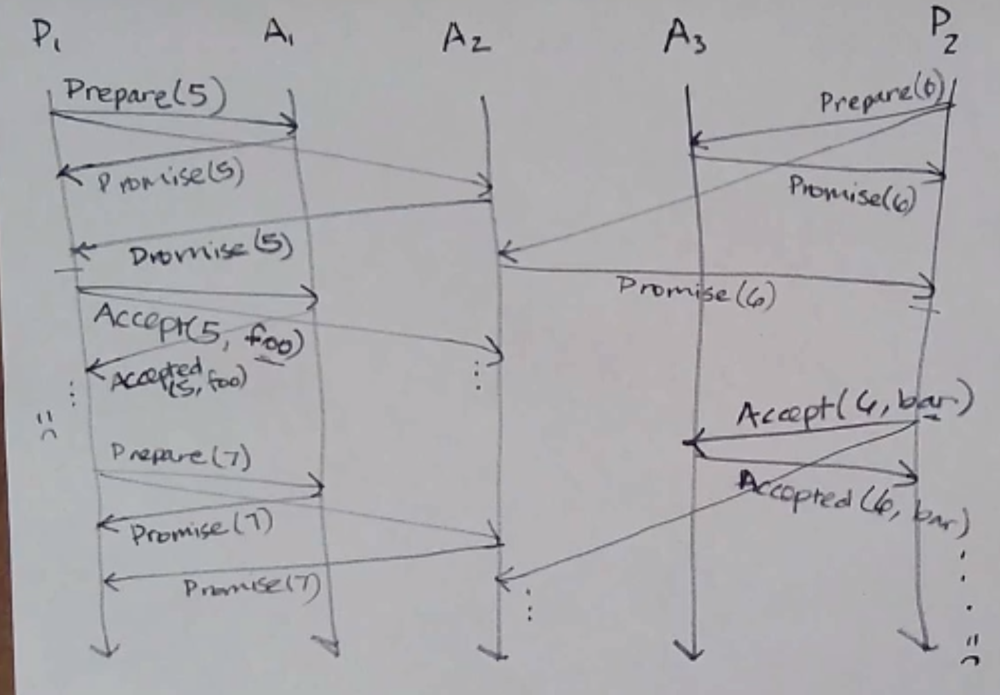
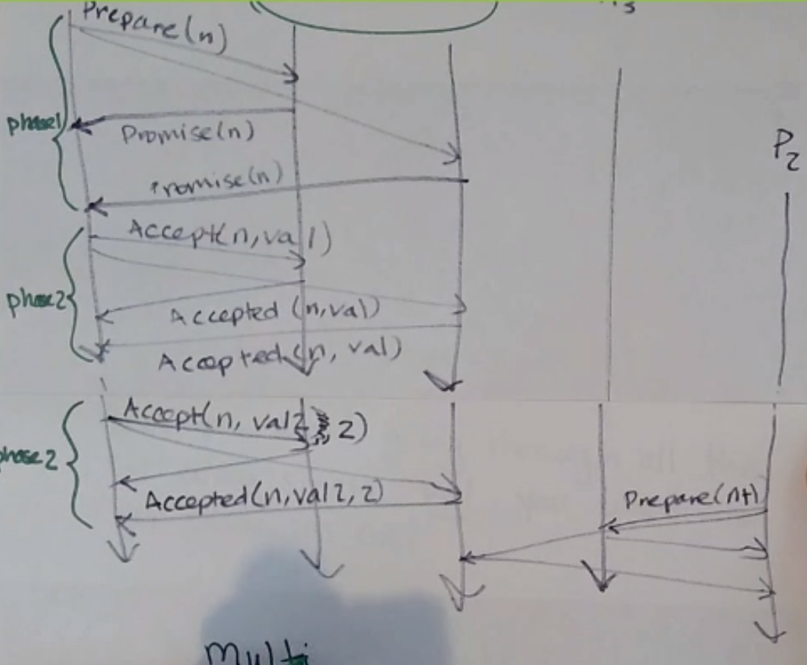
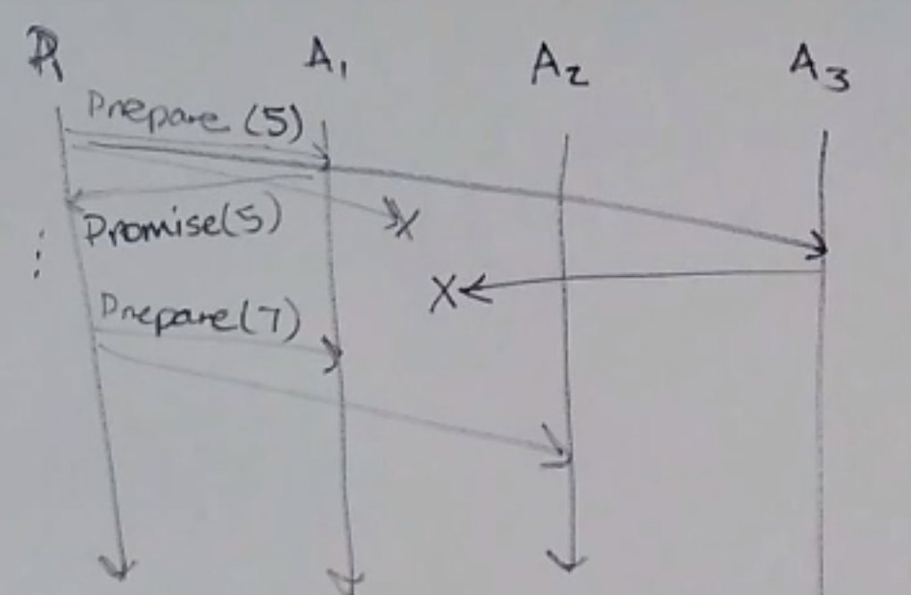

Consensus
=========
Consensus is *hard*.

When do you need it? When you have a bunch of processes, and...

- they need to deliver the same messages, in the same order (**totally-ordered/atomic broadcast**)
- they need to each know what other processes exist, and keep those lists up to date
  (**group membership problem, failure detection**)
- one of them needs to play a particular specific role and the others need to agree who that is (**leader election**)
- they need to be able to take turns accessing a resource that only one can access at a time
  (**mutual exclusion problem**)
- they're participating in a transaction and need to agree on a commit/abort decision
  (**distributed transaction commit**)

We can view consensus as a kind of box, with multiple inputs going in and coming out; the inputs might differ,
but in a correct system, they agree coming out.

Properties
----------
Consensus algorithms try to satisfy the following properties:

- **termination**: each correct process eventually decides on a value (whatever it is)
- **agreement**: all correct processes decide on the *same* value
- **validity** (aka integrity, nontriviality): the agreed-upon value must be one of the proposed values

.. image:: _static/consensus2.png
    :width: 300

.. note::
    In the asynchronous network + crash fault model, no algorithm actually satisfies all 3 of these
    (Fischer, Lynch, Paterson, 1983)! In this model, we have to compromise, and usually it's termination
    that we compromise on.

Paxos
-----
*Leslie Lamport, 1998*

Each process takes on some of 3 roles:

- **proposer** - proposes values
- **acceptor** - contribute to choosing from among the proposed values
- **learner** - learns the agreed-upon value

A process could take on multiple roles, but we usually examine the case where each process only takes on one.
Each process that plays any role is called a *Paxos node*.

Paxos nodes must:

- persist data
- know how many nodes is a majority of acceptors

How it Works
^^^^^^^^^^^^

**Phase 1**

- proposer: sends a prepare message with a unique proposal number to a majority of acceptors, ``Prepare(n)``
    - the proposal number *n* must be unique, and higher than any proposal number that *this* proposer has used before
- acceptor: upon receiving a ``Prepare(n)`` message, check: "did I previously promise to ignore requests with this
  proposal number?"
    - if so, ignore the message
    - otherwise, promise to ignore requests with proposal number < *n*, and reply with ``Promise(n)`` (*)
        - ``Promise(n)``: "I will ignore any request with a proposal number < n"
        - when a majority reply with a promise, we reach a milestone: it is impossible to get a majority to promise
          anything lower than *n*

**Phase 2** - the proposer has received ``Promise(n)`` from a majority of acceptors (for some *n*)

- proposer: send an ``Accept(n, val)`` message to at least a majority of acceptors, where:
    - *n* is the proposal number that was promised
    - *val* is the actual value it wants to propose (**)
- acceptor: upon receiving an ``Accept(n, val)`` message, check if it previously promised to ignore requests with *n*
    - if so, ignore the message
    - otherwise, reply with ``Accepted(n, val)``, and also sends ``Accepted(n, val)`` to all *learners*
        - when the majority of acceptors have sent an ``Accepted(n, val)`` message for a given *n*, we reach a
          milestone: we have consensus on *val* (but no one knows)

When each participant receives ``Accepted`` from a majority of acceptors, then they know consensus is reached
(this happens separately on the proposer and learners)

Getting Weird
^^^^^^^^^^^^^
Consider the following execution:

- P1 sends ``Prepare(5)``
- P2 sends ``Prepare(4)``
    - it doesn't receive ``Promise``s in time, so it tries again with a higher proposal number
- P1 sends ``Accept(5, foo)`` and the acceptors send ``Accepted(5, foo)`` at the same time P2 sends ``Prepare(6)``
- oh no!

So we have to change what happens in phase 1:

- acceptor: upon receiving a ``Prepare(n)`` message, check: "did I previously promise to ignore requests with this
  proposal number?"
    - if so, ignore the message
    - otherwise, **check if it has previously accepted anything**
        - if so, reply with ``Promise(n, (n_prev, val_prev))``, where ``n_prev`` is the highest previously-accepted
          proposal number and ``val_prev`` is the previously accepted proposed value
        - otherwise, reply with ``Promise(n)``

Now, in phase 2, the proposer has to do something different having received ``Promise(n)`` *or*
``Promise(n, (n_prev, val_prev))`` from a majority of acceptors:

- proposer: send an ``Accept(n, val)`` message to at least a majority of acceptors, where:
    - *n* is the proposal number that was promised
    - *val* is **chosen as follows**:
        - the ``val_prev`` corresponding to the highest ``n_prev``
        - or the value it wants, if no ``n_prev`` info was received

Final Algorithm
^^^^^^^^^^^^^^^

**Phase 1**

- proposer: sends a prepare message with a unique proposal number to a majority of acceptors, ``Prepare(n)``
    - the proposal number *n* must be unique, and higher than any proposal number that *this* proposer has used before
- acceptor: upon receiving a ``Prepare(n)`` message, check: "did I previously promise to ignore requests with this
  proposal number?"
    - if so, ignore the message
    - otherwise, check if it has previously accepted anything
        - if so, reply with ``Promise(n, (n_prev, val_prev))``, where ``n_prev`` is the highest previously-accepted
          proposal number and ``val_prev`` is the previously accepted proposed value
        - otherwise, reply with ``Promise(n)``

**Phase 2** - the proposer has received ``Promise(n)`` or ``Promise(n, (n_prev, val_prev))`` from a majority of
acceptors (for some *n*)

- proposer: send an ``Accept(n, val)`` message to at least a majority of acceptors, where:
    - *n* is the proposal number that was promised
    - *val* is chosen as follows:
        - the ``val_prev`` corresponding to the highest ``n_prev``
        - or the value it wants, if no ``n_prev`` info was received
- acceptor: upon receiving an ``Accept(n, val)`` message, check if it previously promised to ignore requests with *n*
    - if so, ignore the message
    - otherwise, reply with ``Accepted(n, val)``, and also sends ``Accepted(n, val)`` to all *learners*
        - when the majority of acceptors have sent an ``Accepted(n, val)`` message for a given *n*, we reach a
          milestone: we have consensus on *val* (but no one knows)

Paxos satisfies agreement and validity! What might cause it not to terminate...?

Non-Termination
^^^^^^^^^^^^^^^
Paxos can fail to terminate if you have *duelling proposers*:

In the above execution, a proposer never receives a majority ``Accepted`` because the other proposer butts in.

So why don't we just always only have one proposer? Theoretically we could just have one process declare itself the
leader and tell the others what the accepted value it is... but picking the leader requires consensus in itself!

We could, however, choose a different leader election protocol to choose the proposer for a paxos run; and that
leader election protocol could have different guarantees (e.g. termination and validity, instead of agreement/validity)

Multi-Paxos
-----------
Paxos is good for gaining consensus on a *single* value - for multiple (e.g. a sequence of values), you have to
rerun the whole thing. What if you want to decide on a *sequence* of values?

For example, if you wanted to implement TO delivery (e.g. in a system where 2 messages are sent), you need to agree on
two values: what message is sent first, and which is second. In normal Paxos, this takes a lot of messages!

What if we (well, the accepted proposer) just kept sending ``Accept`` messages with the same proposal number (i.e. kept
repeating phase 2)? Turns out, you can keep doing this until your messages start getting ignored (i.e. a higher
``Prepare`` is received)!

And if a second process butts in, Multi-Paxos pretty much just becomes normal Paxos.

.. note::
    An alternative way to agree on a sequence is *batching* - queuing up multiple values and using normal Paxos to
    get consensus on a batch at a time.

Paxos: Fault Tolerance
----------------------
We can't have just one acceptor, since it can crash.

Acceptors
^^^^^^^^^
If we have 3 acceptors, only one can crash and Paxos will still work - you need to hear from both live acceptors.

If you have 5, you can accept 2 crashes. In general, a *minority* of acceptors can crash.

If *f* is the number of acceptor crashes you want to tolerate, you need :math:`2f+1` acceptors.

Proposers
^^^^^^^^^
If *f* is the number of proposer crashes you want to tolerate, you need :math:`f+1` proposers.

Omission Faults
^^^^^^^^^^^^^^^
Paxos is tolerant to omission faults (given timeouts) - it might not terminate, but that's already not a guarantee,
so eh. In this scenario, it's *safe* but not *live* - fail-safe.

Other Consensus Protocols
-------------------------

- Raft (Diego Ongaro, John Ousterhout, 2014)
    - designed to be easier to understand than other protocols
- Zab (Zookeeper Atomic Broadcast; Yahoo Research, late 2000s)
- Viewstamped Replication (Brian Oki, Barbara Liskov, 1998)

All of these are for a sequence of values, like Multi-Paxos.

