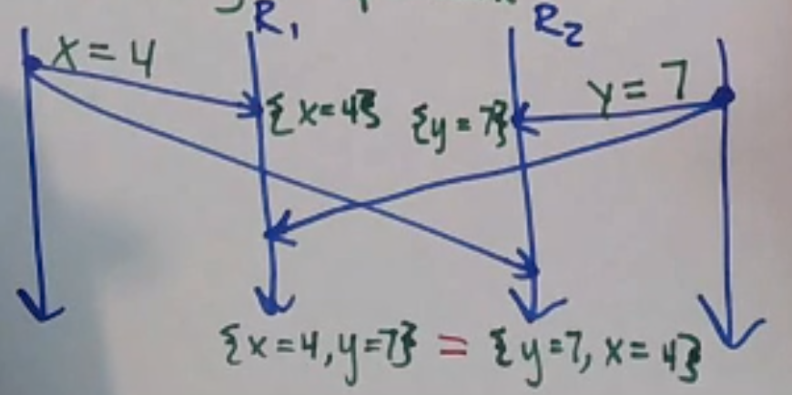
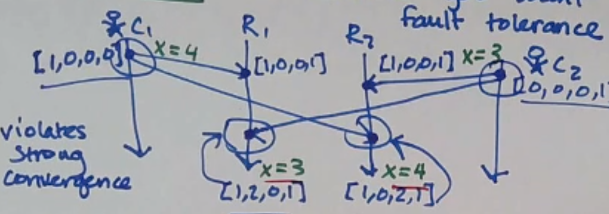
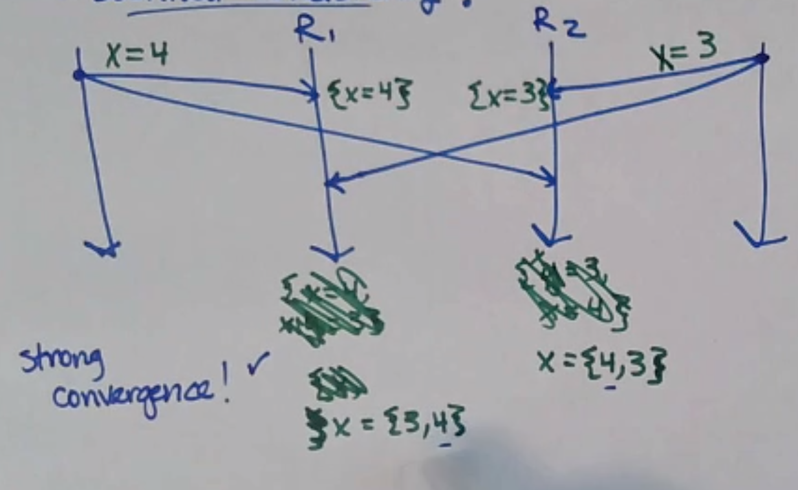
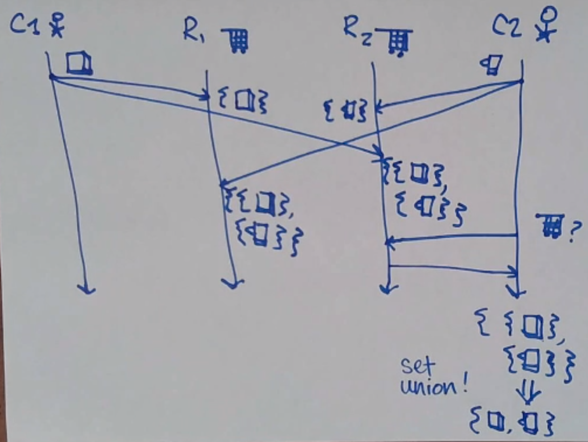
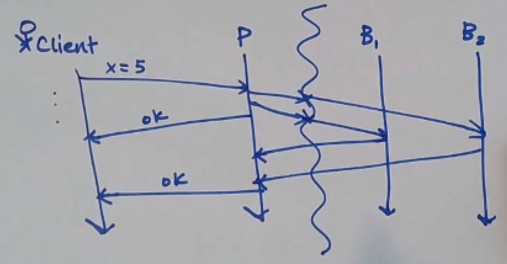
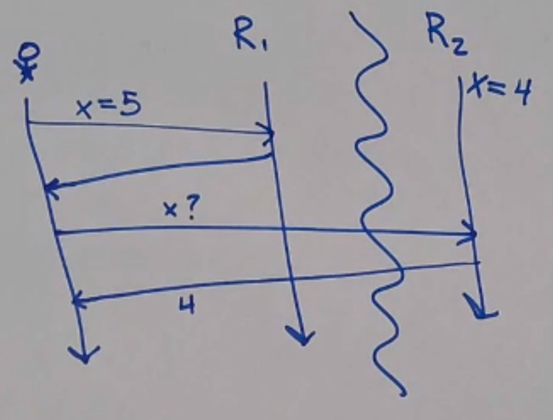
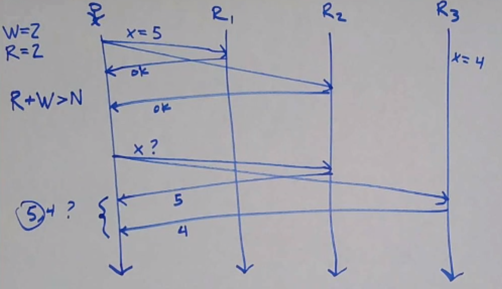

Consistency
===========
*See also: Replication*

Recall: *strong consistency* is when a client can't tell that data is replicated.

Strong consistency ultimately relies on consensus, if you also want fault tolerance. For example, we can't enforce
TO delivery using just vector clocks, but what if we could make it so that the order they arrived in didn't matter?

One example of a case where order doesn't matter is two clients trying to modify different keys:

This isn't *strong* consistency, though - a client could see the replication in the time between the two requests
landing on each replica.

Eventual Consistency
--------------------

.. data:: eventual consistency

    Replicas *eventually agree*, if clients stop submitting updates.

Eventual consistency is a *liveness* property, but usually consistency guarantees are safety properties - it's hard
to consider in the same hierarchy as other guarantees. We do have a related safety property, though:

.. data:: strong convergence

    Replicas that have delivered the same *set* of updates have equivalent state.

This execution fails strong convergence:

But this execution satisfies it:

Often, these two properties are combined into *strong eventual consistency*, which is both a safety and liveness
property.

Concurrency
^^^^^^^^^^^
Strong convergence is easy if different clients write to different keys... what if we wanted different clients write
to the same key?

Let's make our replicas save all concurrent updates in a set! But what does the client do?

Generally, it's up to the client (*application-specific conflict resolution*). In some cases, the client can be smart!
For example, if your state is something like a shopping cart, you can merge the sets!

We'll see more like this in the Dynamo paper.

Misc
----
Terminology used in the Dynamo paper.

.. data:: network partition

    A network partition is a failure state where some part of a network cannot communicate with another part of the
    network:

    .. image:: _static/consistency5.png
        :width: 350

.. data:: availability

    perfect availability: "every request receives a response" - a liveness property

    (usually there's some more to this, like "within X time" or "99th percentile", but this is a fine start)

Consider the following: what if you have a network partition that prevents the primary from communicating with backups -
when should the primary ACK the client?

- We could wait for the partition to heal before ACKing, but then the client could be left waiting a long time.
  This gives you consistency, but less availability.
- We could ACK immediately and do the replication when the partition eventually heals, but then the system is
  inconsistent for some time. This gives you availability, but at the cost of consistency.

Primary-Backup/CR prioritizes consistency over availability; Dynamo et al. choose availability.

If the client can talk to replicas on both sides of the partitions, though, this is bad - the first replica should
probably choose not to ACK the write at all!

This tradeoff is called **CAP**:

.. data:: CAP

    - Consistency
    - Availability
    - Partition tolerance

    It's impossible to have perfect consistency and availability, because of network partitions.

.. note::
    If you happen to be reading these notes front-to-back, you should go take a look at Dynamo now.

Quorum Consistency
------------------
How many replicas should a client talk to? *Quorum systems* let you configure this.

- N: number of replicas
- W: "write quorum" - how many replicas have to acknowledge a write operation to be considered complete
- R: "read quorum" - how many replicas have to have to acknowledge (i.e. respond to) a read operation

Obviously, W <= N and R <= N.

Consider N = 3, W = 3, R = 1 (Read-One-Write-All: ROWA). This doesn't necessarilygive you strong consistency because
replicas might deliver writes from different clients in different orders. There's other problems too, like a network
partition or a failed replica blocking all writes! (Also, it's just slow to write.)

The Dynamo paper suggests, for N = 3, R = 2 and W = 2. This is so read and write quorums overlap:

In general, if R + W > N, read quorums will intersect with write quorums.

Some database systems (e.g. Cassandra) let you configure these constants. For example, if you wanted super fast
writes but less guarantee on consistency, you might set W = 1.

