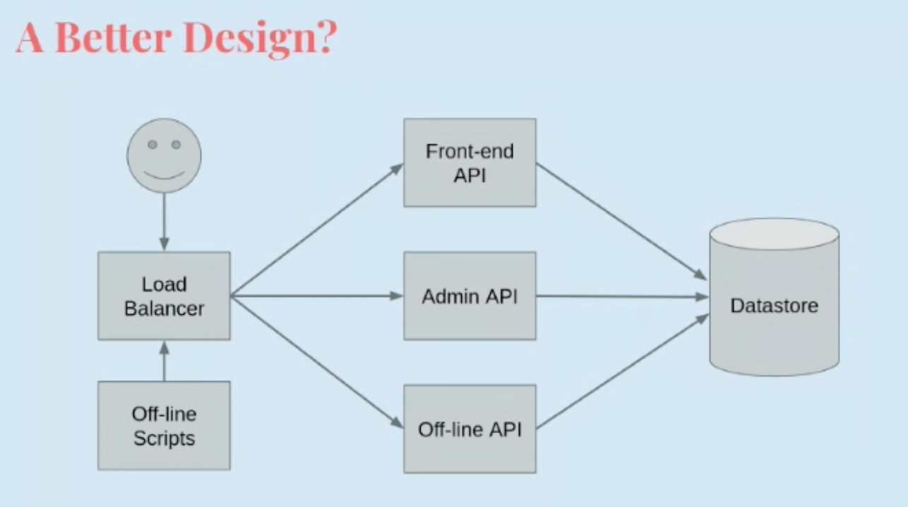
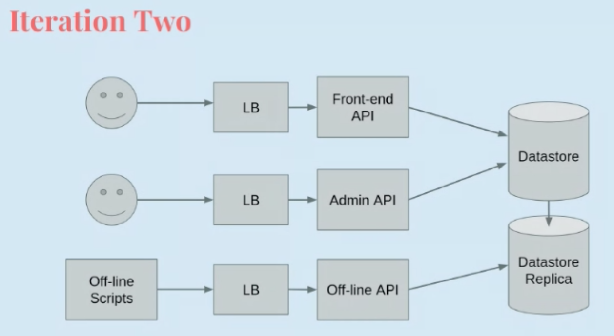
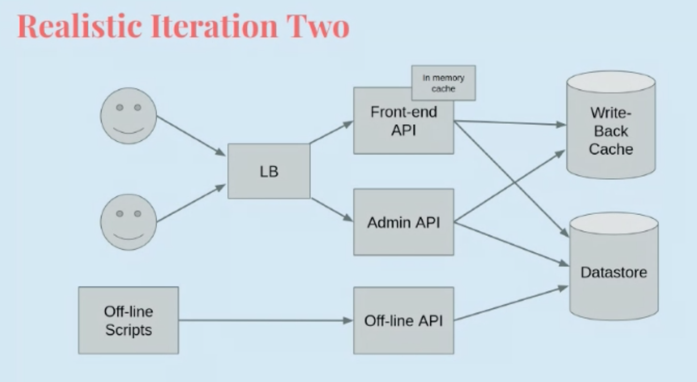
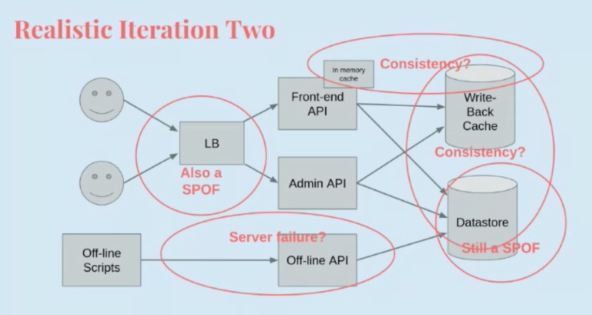

Heterogeneous Distributed Systems
=================================
*guest lecture, Cyrus Hall*

- Heterogeneous systems are the natural outcome of complex products
- Such products have diverse features, making composing them inherently difficult
- Products aimed at humans have more diverse concerns and different priorities

First-Order Distributed Systems
-------------------------------
*Classical distributed systems*

- Multiple processes working toward some common goal
- Distributed, meaning, don't share a memory space
- Have some notion of time (eg. vector clocks)
- Acceptance decisions (what to do with messages, are decisions accepted)
- Trouble scaling to WAN

*more extreme distributed systems*

- Often never actually consistent
- Local decisions are often greedy
- Example is BGP (border gateway protocol) routing in the internet

- there is a singular purpose to the collection of processes
- no common memory space
- all processes run the same algorithm (some may run different parts)
- ex. Paxos, Raft, Dynamo, BGP, TCP, bittorrent, etc

Heterogeneous
-------------
*Heterogeneous* distributed systems are composed of more than one first-order system!

- Often made up of distributed and non-distributed systems
- behaviour determined by the behaviour of the involved 1st order components, and how they're composed
- system composition is primarily a human task
- interaction between systems leads to complex failure modes

Systems are diverse, so it might be hard to compose them together:

- different purpose/goals
- frameworks: languages, APIs, protocols, service discovery framework, etc
- network location
- configuration

Differences in these properties lead to differences in behaviour. Failure, error states, "correctness", etc are
all expressed differently!

Monolith
--------
Lots of web services are monolithic - everything is all shoved into one service!

The service wants to provide multiple interfaces with different requirements ("multi-API syndrome"), though, for
example:

- frontend: on-line tasks, low latency required
- background aggregarion: off-line tasks, high latency is fine
- admin: who even knows lol

So why don't we split those out into 3 different APIs?

Problems
--------

This still has problems, though:

In the backend:

- datastore is a single point of failure for all APIs
- variable request patterns: mix of latency sensitivities, spiky traffic patterns
- resource management is distributed
    - each instance of each API is managing its request rate to the datastore
    - maybe manage request load from each API in datastore layer?
        - won't scale as number of services grow
        - an API later can still overwhelm the central datastore

In the frontend:

- load balancer is a single point of failure for all APIs
- more issues with variable request patterns
    - users can deny off-line scripts from running
    - more importantly, off-line scripts can deny users
- loadbalancer can ratelimit requests, but has fundamental limits (DDoS vuln)
- privacy and security concerns
    - is the load balancer pure or does it cache and replay results?
    - results for an offline system available to users?

TLDR: availability and resiliency are the main concerns

.. data:: availability

    The percentage of the time a system responds

.. data:: resilience

    The ability of a system to remain available (even in the face of spiky events)

Resiliency is the product of many factors, the key elements being:

- failure isolation
- redundancy and ease of scalability
- load management

.. note::
    Availability may *not* mean a service is properly functioning in all respects - this has concerning implications for
    failure detection!

Iteration 2
-----------
Let's iterate again:

We're starting to see a *recursive service pattern*: as a product feature becomes important, the desire to isolate it
grows. Eventually new features and products are just built as a new service.

This iteration looks pretty good, but the real world is not so clean!

- engineering is happening during huge growth
- ops and downtime takes up a ton of engineers' time
- product changes flying thick and fast, sales selling things that don't exist
- etc

But this design brings with it a whole host of interesting new problems:

Specifically, in addition to the SPOFs, cache consistency is really hard to keep in this model! Even just the different
instances of the frontend API might have different data in the cache :(

Business
--------
Heterogeneous systems are, in part, the result of *business* decisions. As engineers, we need to make estimates of
risk and impact known; a healthy balance must be reached between eng, product, and business needs. Heterogeneous system
engineering is partly about finding a sense of zen.

Ideals + Rules of Thumb
-----------------------

- Accept failure
- Embrace error
- If possible, be stateless
- Isolate!!!!!!

Ideally, each system and service should:

- address a single concern
- loosely couple with other systems
- be easy to maintain (and test!)
- be independently and repeatedly deployable
- have clear documentation of its behaviour and semantics

Some rules of thumb:

- retries are dangerous (in heterogeneous systems)
    - certain operations might not be idempotent (e.g. ``INCR``)
    - a web server that tries to charge a credit card to display an order to the frontend fails (might be ok to retry IF
      the credit card processor guarantees that not only did it fail, it didn't already charge)
- make stateless requests
    - it's hard not to retry if a transaction is completed in multiple requests or it's not idempotent
    - use idempotent requests whereever possible (e.g. ``SET`` vs ``INCR``)
- propagate errors early
    - if some downstream service gets an error, make the error the original requester's problem
    - lets us know the system is struggling
    - often the original request is no longer important - user has moved on or never cared
    - even better with active load control (e.g. queueing - is your dependency healthy?)
- retries can be a necessary evil
    - but have backups!
- ratelimit traffic!
    - each system has a max sustainable load peak
    - you should ratelimit to X% of the peak sustainable rate (like, 95-98%)
    - use a benchmarker to calculate this rate

Conclusion
----------

- complex business processes and lifecycles lead to heterogeneous systems
- holding back the business is not the right tradeoff
- we can use isolation and loose coupling (and other) to mitigate complexity
- systems design is a social process

Contact: cyrusphall (at) gmail
