Dynamo
======
This section of notes discusses concepts found in the Dynamo paper, at
http://composition.al/CSE138-2021-03/readings/dynamo.pdf.

Concepts
--------

- availability
    - "every request will receive a response" (quickly? 99.9% of requests?)
- network partitions
    - some machine(s) can't talk to other(s)
    - temporary and unintentional
- eventual consistency
    - a liveness property
    - "replicas eventually agree if updates stop arriving"
    - Doug Terry, Bayou, 1995
- application-specific conflict resolution
    - the client can resolve conflicting states (e.g. merging shopping carts)
    - dynamo: deleted items can reappear in a cart (bug)
    - dynamo: if client has no specific conflict resolution, last write wins (LWW)

Consider the problem of adding items to a shopping cart: writes commute, which implies strong convergence (replicas that
deliver the same set of requests have the same state).

Disagreements
-------------
Dealing with replicas that disagree: the first step is to find out that some replicas disagree.

Dynamo has 2 concepts to deal with disagreements: anti-entropy and gossip.

.. data:: anti-entropy

    resolving conflicts in application state (a KVS)

.. data:: gossip

    resolving conflicts in view state / group membership (what nodes are alive?)

.. note::
    In general, anti-entropy and gossip are synonymous, but they have differing meanings in Dynamo.

Merkle Trees
------------
In Dynamo, KVS states are *large*, but the view state is generally small. To compare KVS states without sending the
entire state, Dynamo uses *Merkle trees* (hash trees) - each leaf is a hash of a KVS pair, and each parent is a hash
of its children. Two replicas can then compare their root node - if it's equal, all leaves must be equal; otherwise,
compare the direct children and so on.

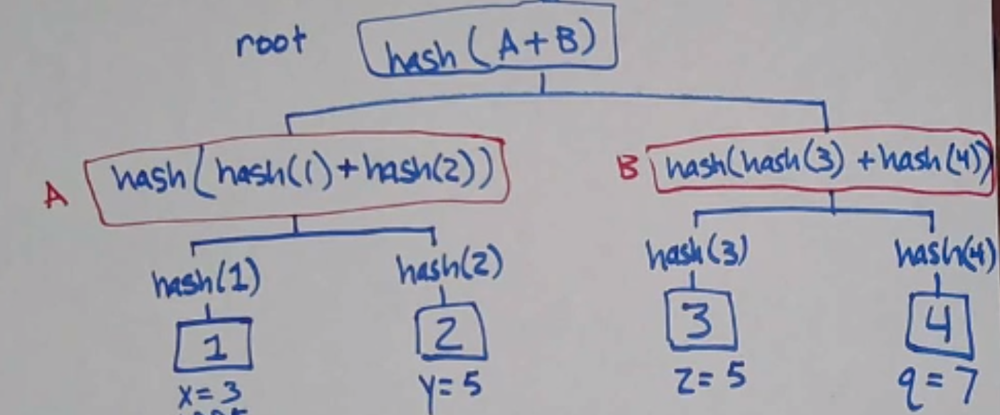

Tail Latency
------------
Recall: latency = time between the start and end of a single action

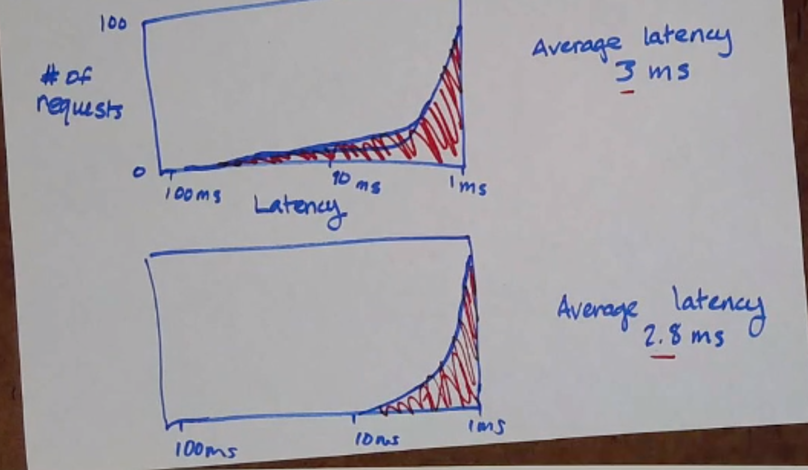

But the top one is worse than the bottom! Tail latency examines the latency of the worst requests (e.g. the 99.9th
percentile).

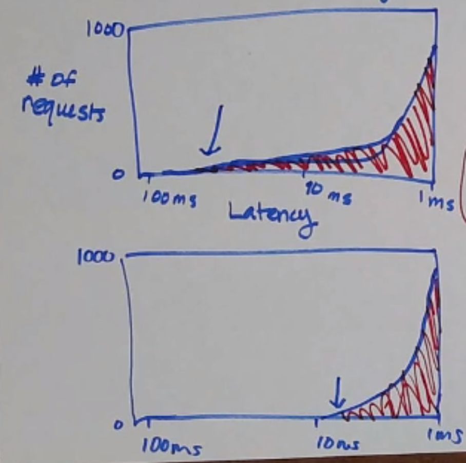

Dynamo has very good tail latency.

Sharding
--------
What's wrong with the approach where *everyone* stores *all* the data?

- what if you have more data than fits on one machine?
- if everyone stores all the data, consistency is more expensive to maintain

Let's store different partitions of data on different machines instead!

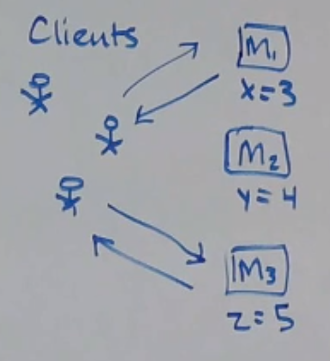

But now you lose fault tolerance... so let's replicate it some!

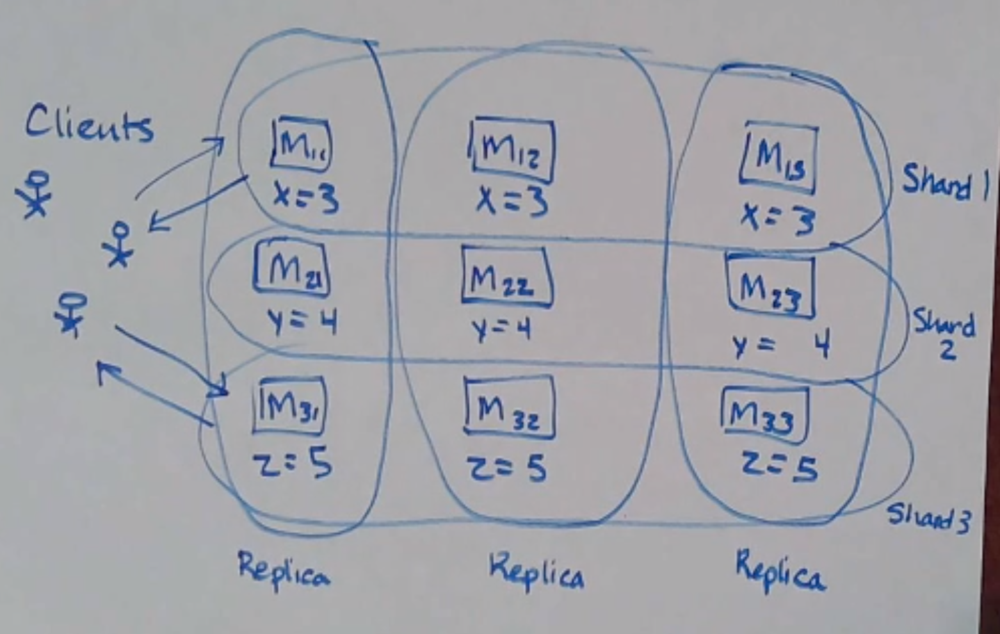

This is called *data partitioning* or *sharding*. Sharding gives you:

- increased capacity
- increased throughput

.. note::
    Choice of replication is usually orthogonal to how you choose to shard your data; in the notes below, we focus
    only on sharding and not replication.

Let's consider a different sharding setup: where each machine acts as a primary for some part of the data, and the
backup for some other set of data!

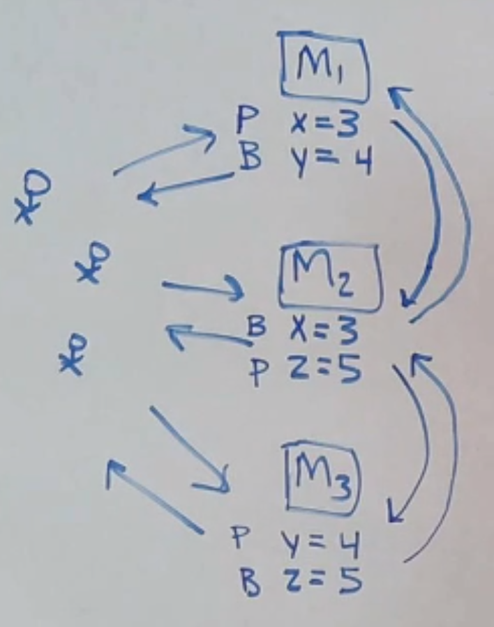

Now you have more than one shard per node.

How to Shard
^^^^^^^^^^^^
How do we choose how to split up our data among the shards?

What makes a sharding strategy good?

Consider the following strategies:

- randomly assigning data to nodes
    - data is evenly distributed
    - it's hard to find where a specific piece of data is
- assign all data to one node
    - easy to find where a specific piece of data is
    - data is very unevenly distributed
- partition by key range
    - easy to find where a specific piece of data is
    - data can be unevenly distributed if keys are not evenly distributed
    - we can make it more uniform by *hashing* the keys (and modulo num of shards)

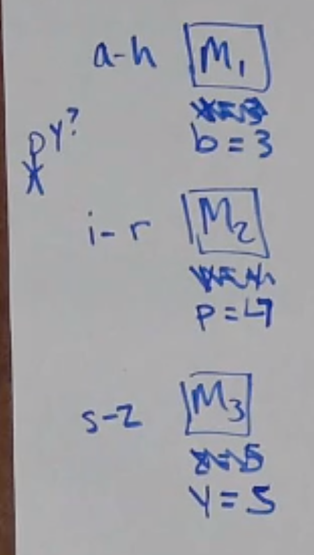

*key range partitioning*

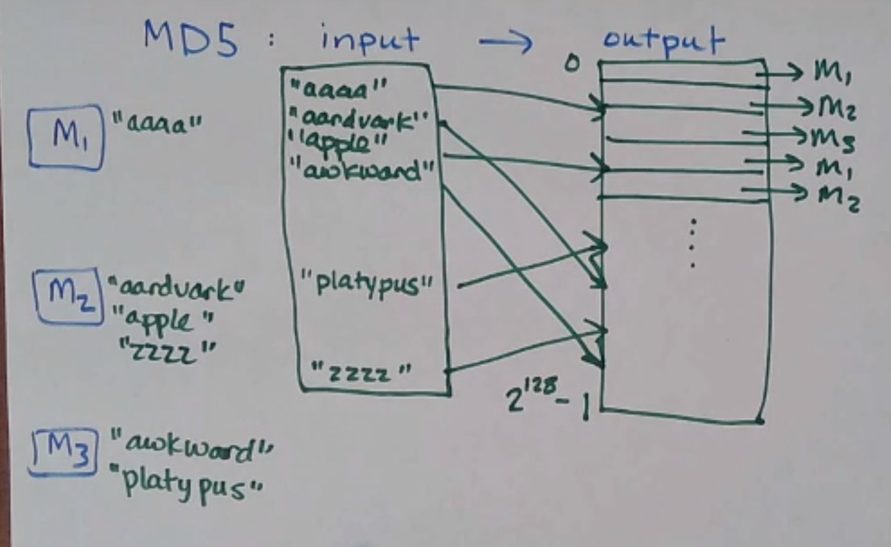

*key hashing*

But partitioning based on hash(key) % N causes problems... what if you add (or remove) a machine? Now everything is
off, and you have to rebalance the whole keyspace across the new nodes! It might not just be moving data to the new
machine - you have to move data between the old machines, too.

**Drawback**: too much data movement when N changes.

How do we move as little data as possible to achieve an even split? It turns out that the minimum movement possible
is :math:`\frac{K}{N}`, where *K* is the number of keys and *N* is the number of machines.

We use a mechanism called *consistent hashing* to get this minimum movement!

Consistent Hashing
------------------
Think of the hash space as a ring, and each node has a position on the ring:

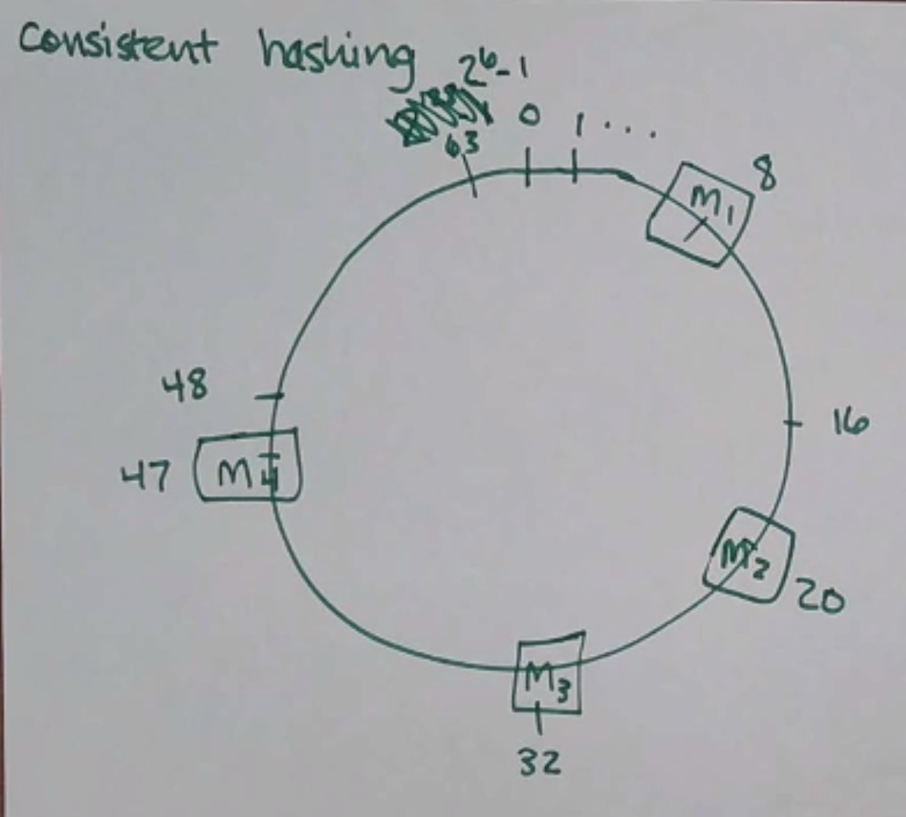

Now, we want to add a data point. We hash the key and it gives us a point on the ring - we then walk clockwise
to find the next server on the ring. The key lives on that server! Additionally, to do some replication, the key lives
on the next couple servers along the ring, too:

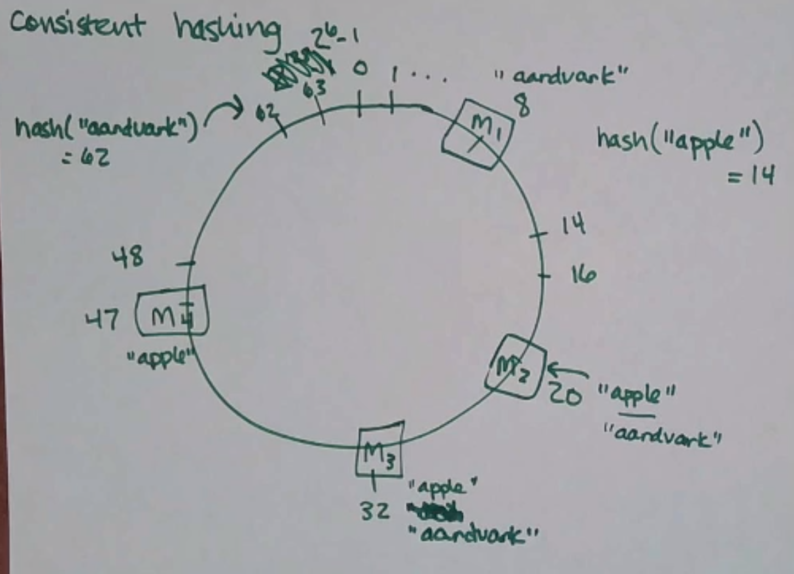

(in Dynamo it's a little more complicated, each key has a preference list that is greater than the replication factor)

Adding Nodes
^^^^^^^^^^^^

Now, when we add a new node, we only have to move the keys along the ring in the range between the previous
node and the new node (e.g. adding M5 below moves the keys between 48-60 to M5 from M1).

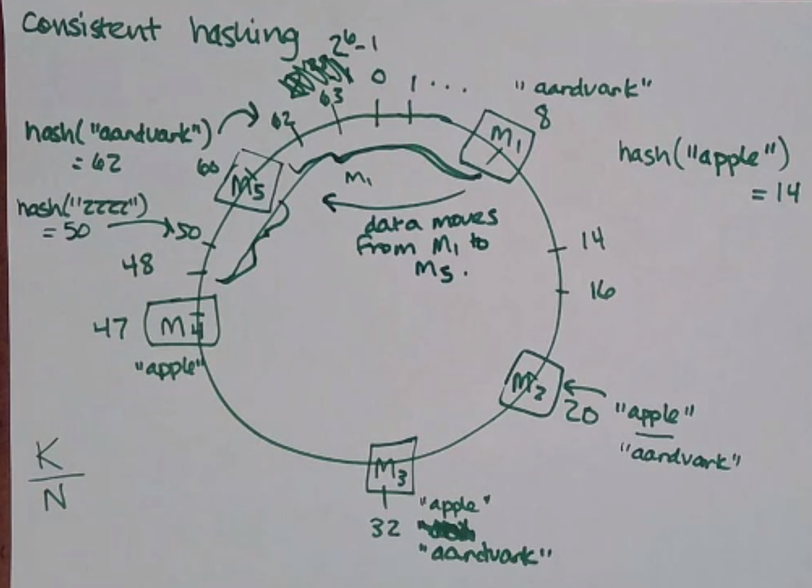

On average, you only have to move :math:`\frac{K}{N}` pieces of data, and only 2 nodes (the added one and the one after
it) are affected!

Crashing Nodes
^^^^^^^^^^^^^^

What if a node crashes? For example, if M2 crashes, M3 becomes responsible for M2's range, and M3 becomes responsible
for any keys that hash to 9-20 as well:

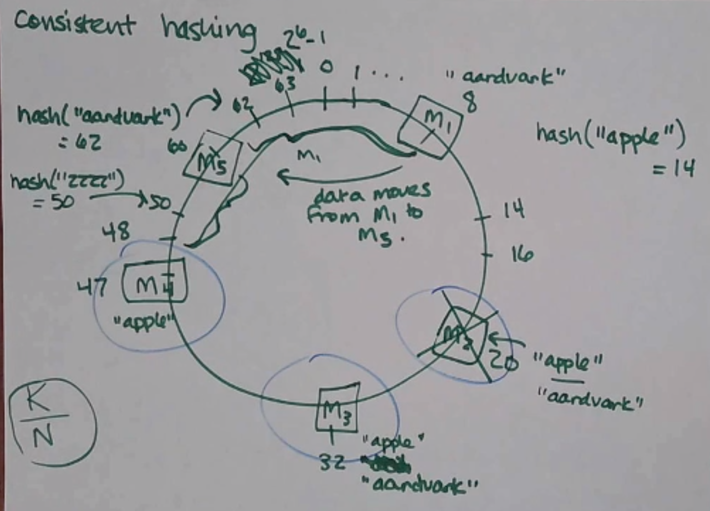

But other nodes are unaffected! And in Dynamo, since we replicate keys past a key's home node, M3 just picks up all the
keys left homeless by M2's death!

Oh No
^^^^^
What could possibly go wrong?

- cascading crashes: a machine doesn't have the capacity to pick up the slack caused by another crashing and crashes too
- the nodes aren't actually evenly spaced
    - dynamo fixes this by hashing to multiple places on the ring ("virtual nodes"), instead of just one
    - virtual nodes also lets you add more load to machines with more capacity (give it more vnodes)
    - but using virtual nodes creates a bunch of little places along the ring that get affected when a physical node
      crashes (which may be a good or a bad thing - more nodes have to take action, but less chance of cascading crash)
    - you also have to be careful that not all your replication to other virtual nodes end up on the same physical node
