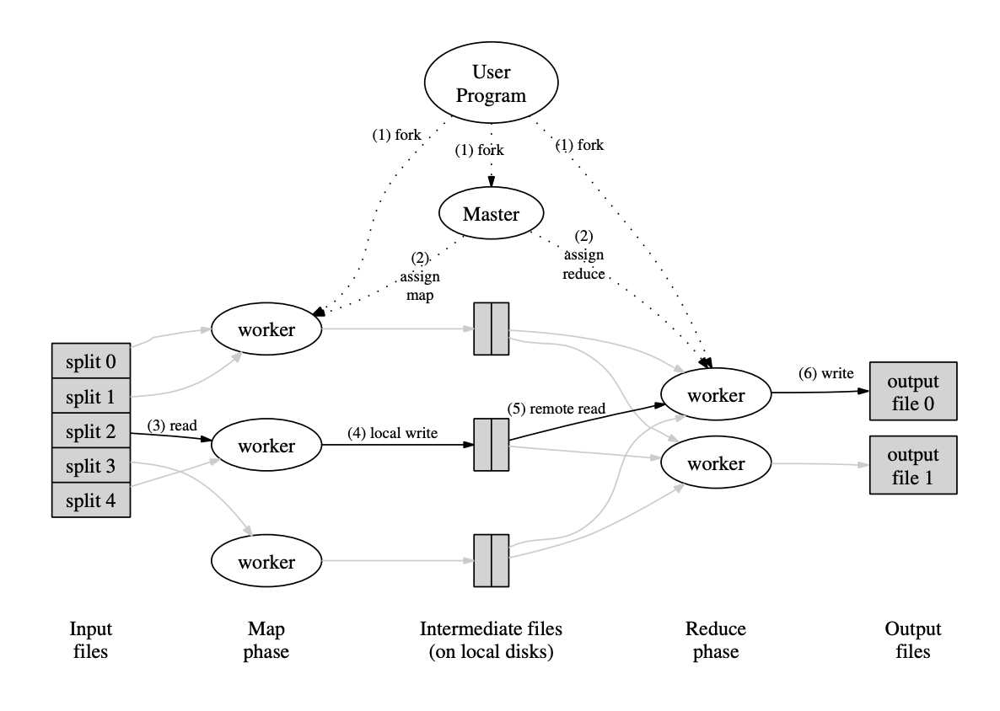
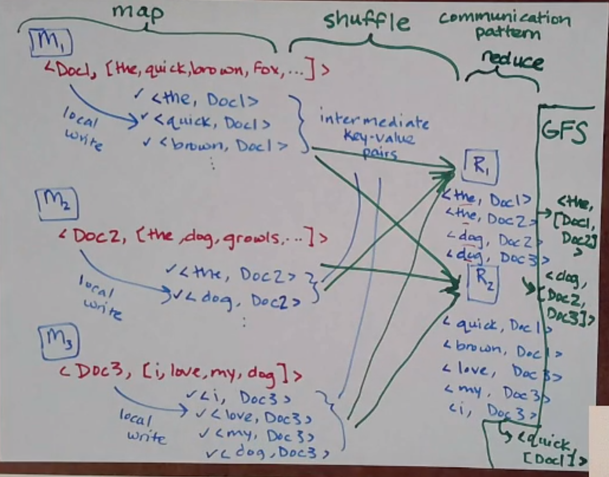
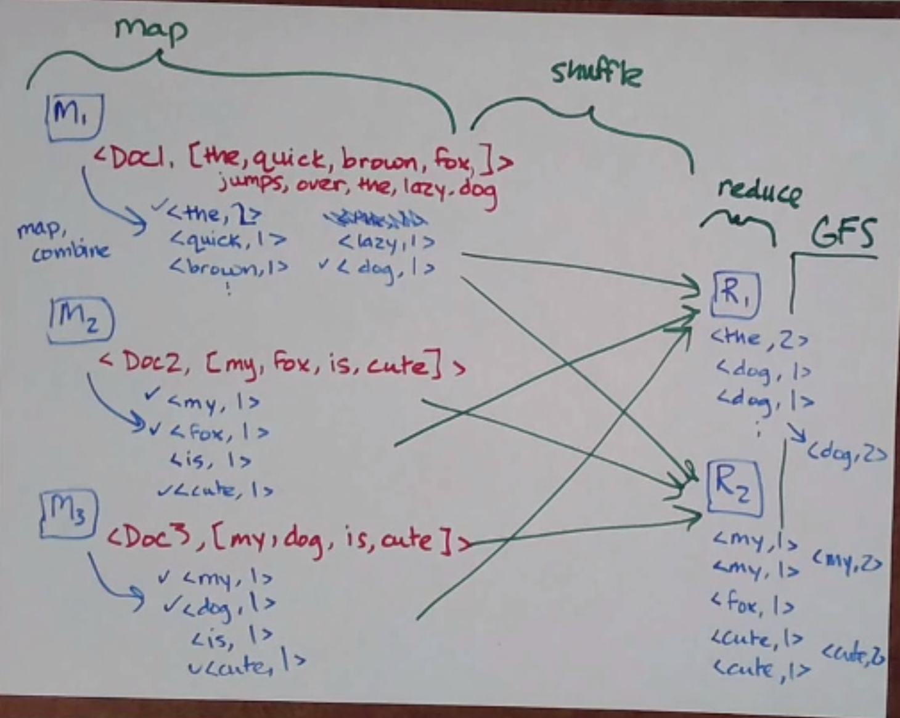

MapReduce
=========
This section of notes discusses concepts found in the MapReduce paper, at
http://composition.al/CSE138-2021-03/readings/mapreduce.pdf

Online v. Offline Systems
-------------------------

.. data:: online systems

    AKA services - e.g. KVSes, web servers, databases, caches, etc.

    These services wait for requests to arrive from clients, and then handle them quickly. Low latency and availability
    are often prioritized.

.. data:: offline systems

    AKA batch processing systems - e.g. MapReduce

    These services are focused around processing a lot of data, not necessarily for a client. High throughput is often
    prioritized.

.. note::
    There is a class of system somewhere between on- and offline systems, which have to process a lot of data but also
    have to be responsive to the data as you get it - this class is pretty recent, and is casually called "streaming
    systems". They might be used in systems like Google Docs or Twitch.

How do you shard data that might be related? Partitioning by key, for example, might have one key that references
another in a different shard. (e.g. in SQL)

So why MapReduce? The same underlying data might need different representations (e.g. for a data analyst) that would be
really slow to generate online, but the clients don't want all their requests to be slow. Instead, we can generate
the different representations offline and store a copy for our clients when they need it.

.. data:: raw data

    the authoritative version of the data - the format new data is stored in

.. data:: derived data

    the result of taking existing data (either raw or derived) and processing it somehow

One example of derived data is inverted indexes (e.g. word -> docs, where forward is doc -> words) - used in search
engines to support fast lookup by word.

We could create an inverted index from a forward index using something like this:

.. code-block:: python

    # step 1: map
    >>> for doc in documents:
    ...     for word in doc:
    ...         yield (word, doc)

    (the, Doc1)
    (quick, Doc1)
    # ...
    (the, Doc2)
    (dog, Doc2)

    # step 2: reduce
    >>> ind = {}
    >>> for word, doc in pairs:
    ...     ind[word].append(doc)

    {
        the: [Doc1, Doc2],
        quick: [Doc1],
        dog: [Doc2]
    }

Now, this algorithm isn't particularly complicated on its own. But how do we run this at a *large* scale?

MapReduce
---------
In MapReduce, many of the algs were conceptually simple - the hard part was running it on a huge amount of data in a
distributed fashion. What if our forward index is too large to fit on one machine? What if the inverted index is?

It turns out for this problem, we can easily parallelize by distributing docs to different machines! Each machine
can generate a set of *intermediate key-value pairs* and then save them locally without having to do any computation -
then reducer machines can grab some set of intermediate key-value pairs (e.g. grouped by ``hash(key) % R``) to solve
them and save them to some file system (e.g. GFS).

Note that a lot of the work is done in the transfer of data between mappers and reducers, where reducers are reading
from multiple mappers - this communication pattern is called the *shuffle* and is expensive!

This MapReduce pattern is not specific to just this problem - you can use this same framework for a whole bunch
of tasks while writing very little code (the map and reduce functions)!

.. note::
    MapReduce has an open-source clone called Hadoop, and a GFS-equivalent called HDFS.

Other tasks that MapReduce can do include:

- inverted index
- grep (regex match)
- sort
- word count
- etc.

Word Count
----------
Another example: word count - this introduces the concept of a *combiner* function, where each mapper does a little
bit of the reducing so less data has to be shuffled.

What Could Go Wrong
-------------------
MapReduce uses ``hash(key) % R`` to assign reduce jobs to reduce workers, even though hash-mod has problems in
data replication - it's fine here because you know the data amount that needs processing, so you can set *R*
up front (it's an offline system).

This differs to an online system, which might need to scale replicas in response to traffic patterns.

If a worker crashes, each task (map, reduce on a subset of data) is deterministic, so a master node can just reassign
the task to a new worker. (They just redo the task since the intermediate result is stored locally instead of on, say,
GFS - less overhead that way.)
