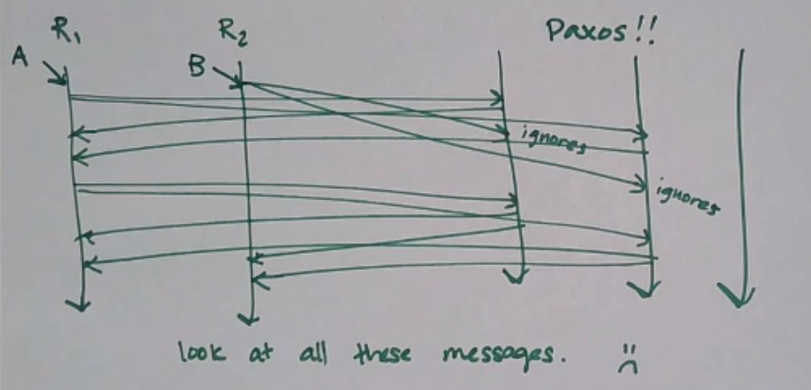

Math
====

The Cost of Consensus
---------------------
Consensus takes up a *lot* of messages.

This is because the consensus algorithms we study try to approach strong consistency, regardless of whatever the content
of the messages we're sending is. But in many cases, we don't need full strong consistency - just strong *convergence*.

Strong Convergence
------------------
.. data:: strong convergence

    Replicas that have delivered the same set of updates have equivalent state.

So what's the math behind strong convergence? Recall partial orders:

.. data:: partially ordered set (poset)

    A set *S*, together with a binary relation :math:`\sqsubseteq` that relates elements of *S* to each other, where
    :math:`\sqsubseteq` has the following properties:

    1. reflexivity: :math:`\forall a \in S, a \sqsubseteq a`
    2. antisymmetry: :math:`\forall a, b \in S, a \sqsubseteq b \land b \sqsubseteq a \implies a = b`
    3. transitivity: :math:`\forall a, b, c \in S, a \sqsubseteq b, b \sqsubseteq c \implies a \sqsubseteq c`

An example of a poset is the set of all subsets of some other set, along with the subset relationship.

E.g. given the set :math:`\{A, B, C\}`, the poset
:math:`S = \{\{\}, \{A\}, \{B\}, \{C\}, \{A, B\}, \{B, C\}, \{A, C\}, \{A, B, C\}\}`.

Upper Bounds
------------
Ex. How many elements of *S* are at least "as big as" (e.g. greater than by subset relation) both of
:math:`\{A\}, \{B\}`? There are two: :math:`\{A, B\}, \{A, B, C\}`. These are called the *upper bounds* of :math:`\{A\}`
and :math:`\{B\}`.

.. data:: upper bound

    Given a partially ordered set :math:`(S, \sqsubseteq)`, an upper bound of :math:`a, b \in S` is an element
    :math:`u \in S` such that :math:`a \sqsubseteq u` and :math:`b \sqsubseteq u`.

A particular pair of elements may have many upper bounds, but the interesting one is usually the smallest one.

.. data:: least upper bound

    An upper bound *u* of :math:`a, b \in S` is the *least upper bound* (aka lub, join) if :math:`u \sqsubseteq v` for
    each upper bound *v* of *a* and *b*.

.. note::
    In our example above, every possible pair of elements has a least upper bound.

.. data:: join-semilattice

    A partially ordered set in which every two elements have a least upper bound is called a *join-semilattice*.

Examples
--------
Consider a register which can take one of three states :math:`(true, false, empty)`, where :math:`empty \leq true` and
:math:`empty \leq false`. If two clients set the register to different non-empty values simultaneously, there is no
upper bound, so you'd have to use some sort of consensus to resolve the conflict.

However, if the elements are members of a joined semilattice, there is a natural way to do conflict resolution.

Read more: Conflict-Free Replicated Data Types (the above is an example of a state-based CRDT).

Another example may be if each client only communicates with one replica - it's up to the replicas to share state
and resolve conflicts using lubs.

The states that replicas can take on are elements of a joined semilattice, whenever a conflict comes up, you can resolve
it by taking the least upper bound.

.. note::
    This gets harder to handle when you have to deal with removing things from a set, not just adding them! One
    solution is to track the set of all items that have been deleted ("tombstone sets"), but this takes space...!