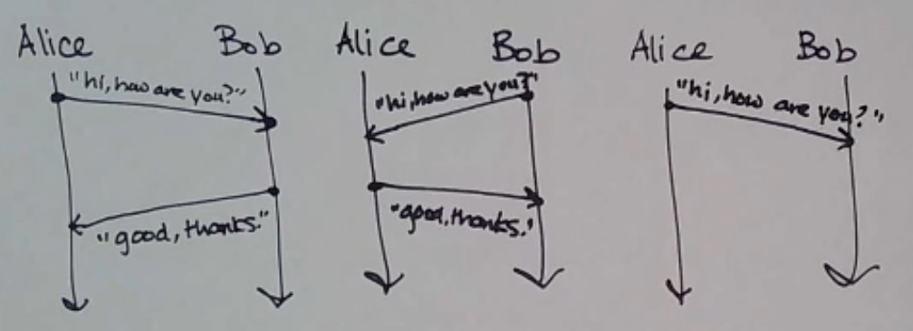
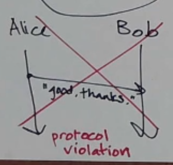
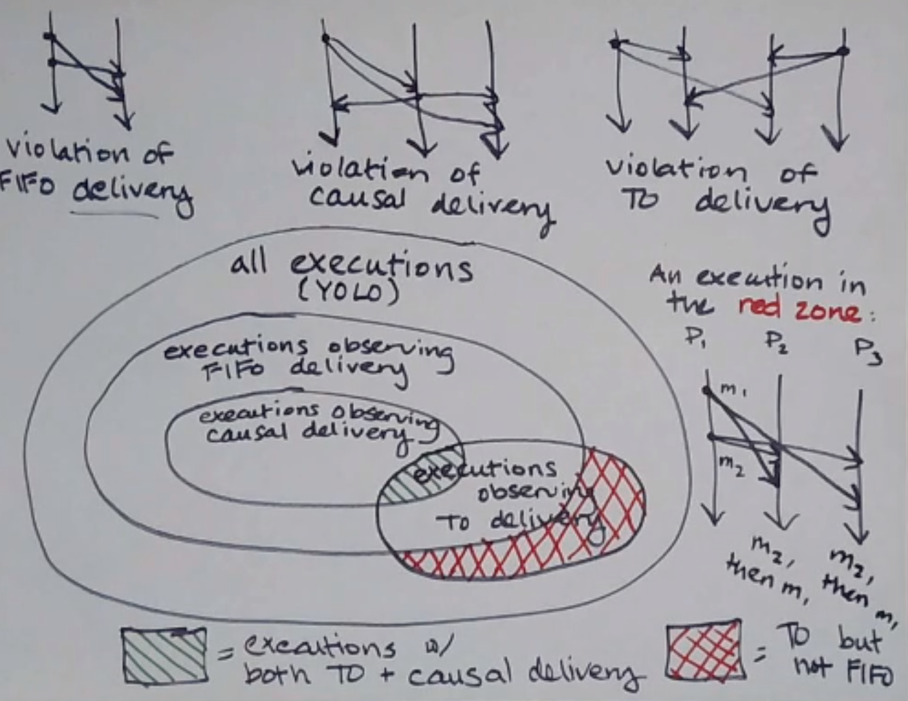
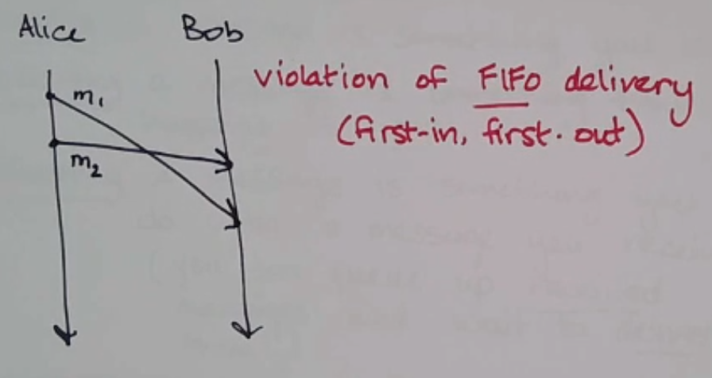
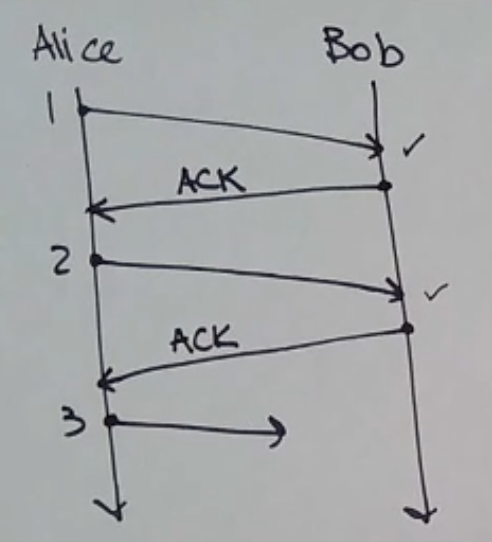
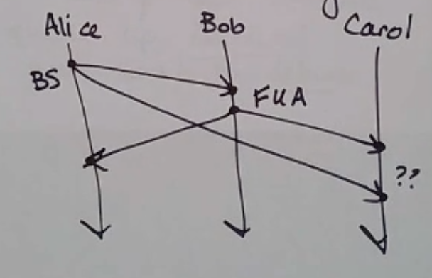
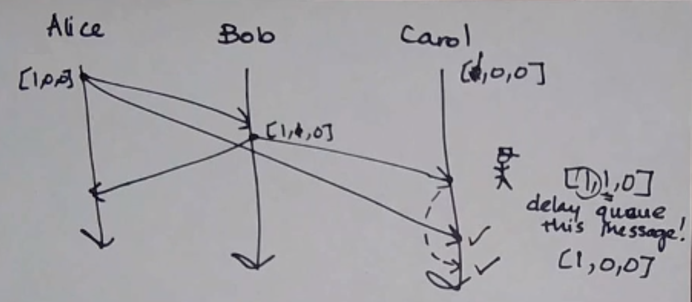
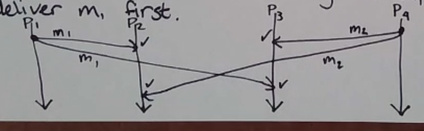

Protocol
========

.. data:: protocol

    A set of rules that processes use to communicate with each other.

e.g. "At any point a machine can wake up and send 'hi, how are you?', and the receiver must reply with
'good, thanks'."

These are all Lamport diagrams of valid runs of the protocol - even though the third doesn't have a response yet,
we may have just caught it before it has had a chance to reply.

There are in fact *infinite* diagrams representing a valid run of the protocol! We can also draw diagrams representing
a violation of the protocol:

The following are three different correctness properties of executions:

FIFO Delivery
-------------
if a process sends message :math:`m_2` after message :math:`m_1`, any process *delivering* both
delivers :math:`m_1` first.

.. note::
    - *Sending* a message is something you do
    - *Receiving* a message is something that happens to you
    - *Delivering* a message is something you *can* do with a message you receive (you can queue up receives and wait
      to deliver them)

Most systems programmers don't have to worry about this often - it's already part of TCP!

Sequence Numbers
^^^^^^^^^^^^^^^^
This can be implemented using *sequence numbers*:

- messages are tagged with the sender ID, and sender sequence number
- senders increment their sequence number after sending
- if a received message's sequence number is (previously received seq num) + 1, deliver it

However, this only works well if you also have *reliable delivery* - if not, and the receiver misses one, it will
buffer all future messages forever.

There are some solutions to this - like ignoring the missed message and delivering all buffered ones - but if the
missed one shows up later, it has to be dropped.

Also, just dropping every single message satisfies FIFO vacuously.

ACK
^^^
Another implementation is ACK - Alice waits for Bob to send an acknowledgement before sending the next message.

However, it's a lot slower since it requires a full round trip per message.

Causal Delivery
---------------
If :math:`m_1`'s send happened before :math:`m_2`'s send, then :math:`m_1`'s delivery must happen before :math:`m_2`'s
delivery.

The violation of FIFO delivery above is also a violation of causal delivery:

Note that however, this diagram does not violate FIFO delivery, since FIFO delivery only accounts for messages
sent from a single process.

It is a violation of *causal delivery*, though.

Implementing Causal Broadcast
^^^^^^^^^^^^^^^^^^^^^^^^^^^^^

.. data:: unicast

    1 sender, 1 receiver (aka point-to-point)

.. data:: multicast

    1 sender, many receivers

.. data:: broadcast

    1 sender, *all* processes in the system receive

For all of these above, no matter how many receivers there are, each send is considered one message.

First, we'll examine the **vector clocks algorithm** with a twist: *message receives don't count as events*.

- Every process keeps a VC, initially 0's
- When a process sends a message, it increments its own position in the VC, and includes the updated VC with the
  message
- When a process *delivers* a message, it updates its VC to the pointwise maximum of its local VC and the message's

.. data:: causal delivery

    the property of executions that we care about today

.. data:: causal broadcast

    an algorithm that gives you causal delivery in a setting where all messages are broadcast messages

We want to define a deliverability condition that tells us whether or not a received message is os is not OK to deliver.
This deliverability condition will use the vector clock on the message.

.. data:: deliverability

    a message *m* is deliverable at a process *p* if:

    - :math:`VC(m)[k] = VC(p)[k] + 1`, where *k* is the sender's position
    - :math:`VC(m)[k] \leq VC(p)[k]`, for every other *k*

If a message is not deliverable, add it to the delivery queue, and check for deliverability each time you receive
a new message (update your VC).

Totally Ordered Delivery
------------------------
If a process delivers :math:`m_1` then :math:`m_2`, then *all* processes delivering both :math:`m_1` and :math:`m_2`
deliver :math:`m_1` first.

The image below is a violation, since P2 delivers 1 then 2, but P3 delivers 2 then 1.

