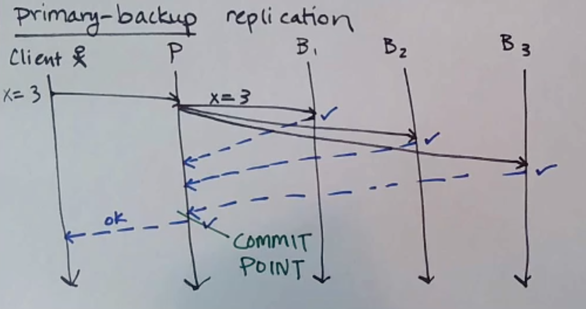
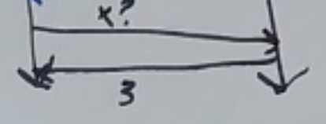
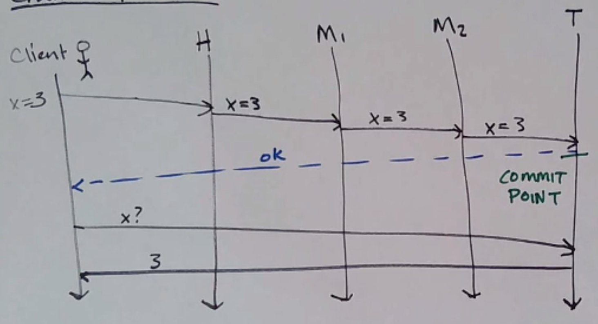
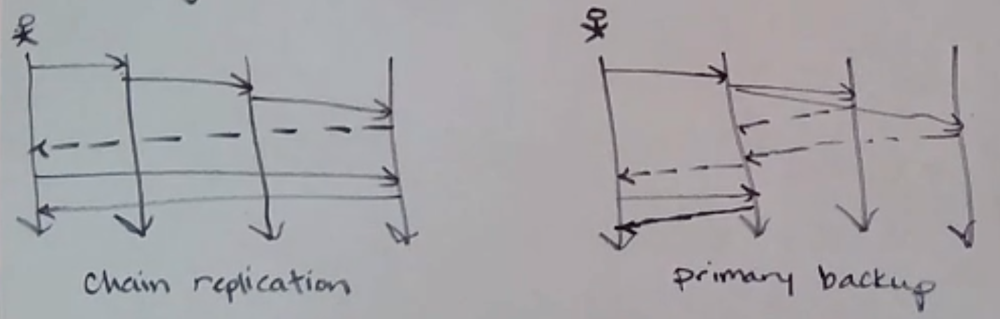
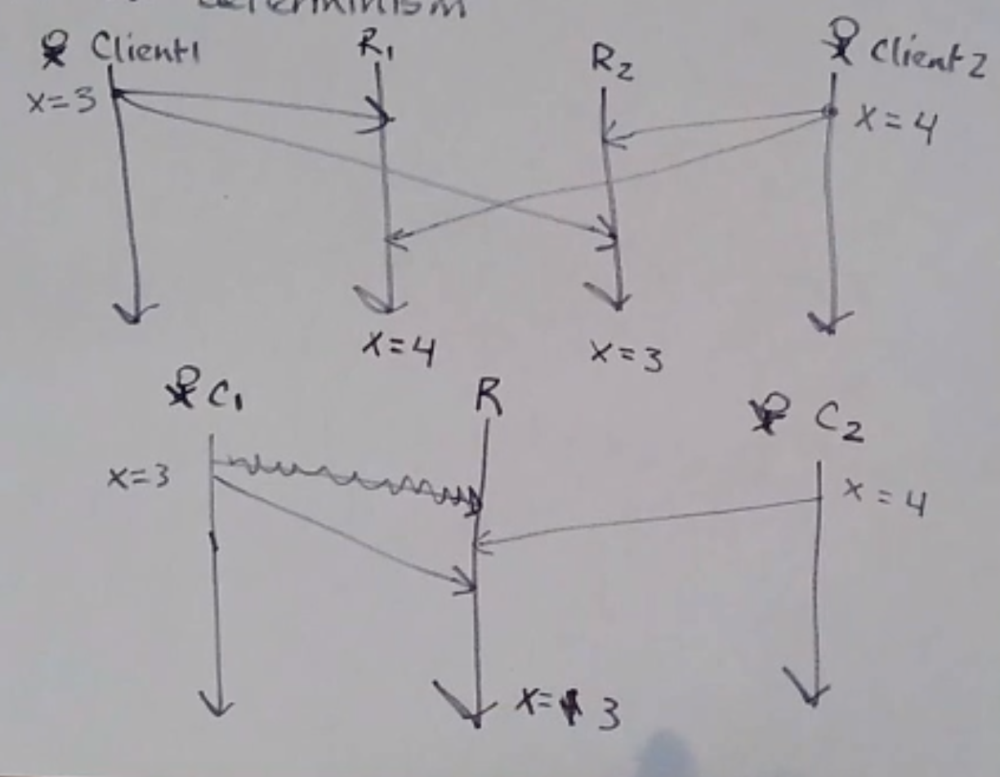
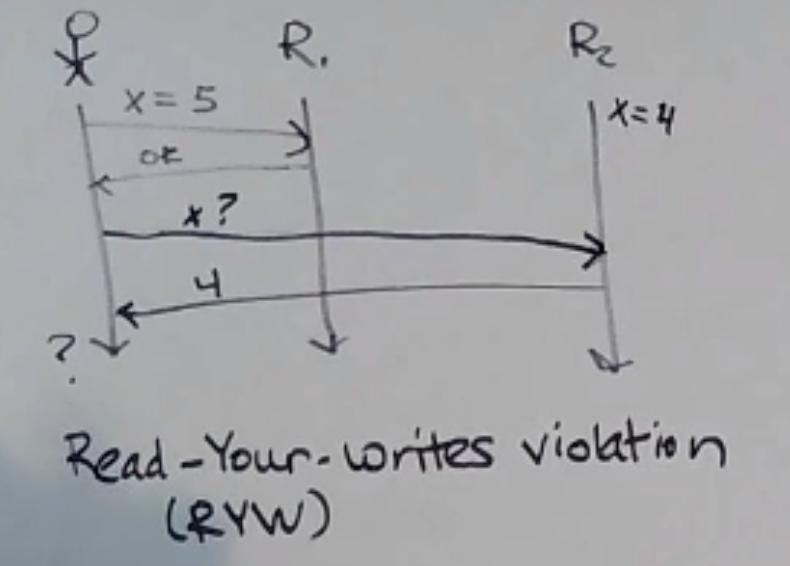
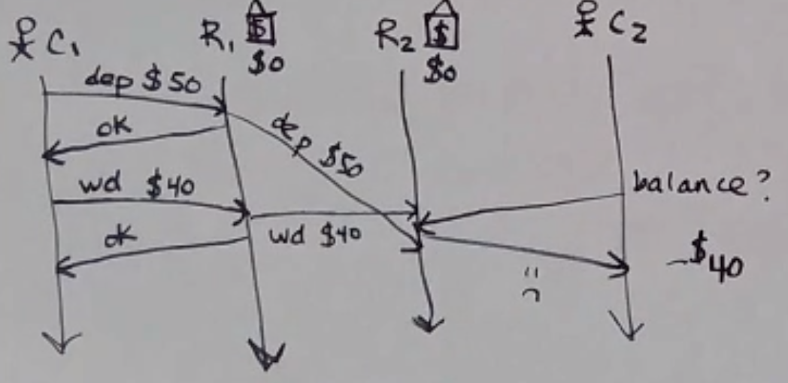
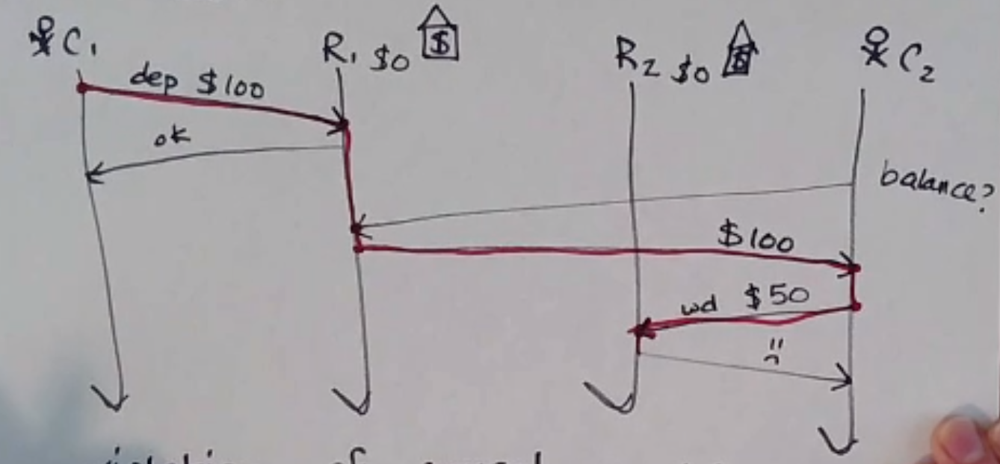
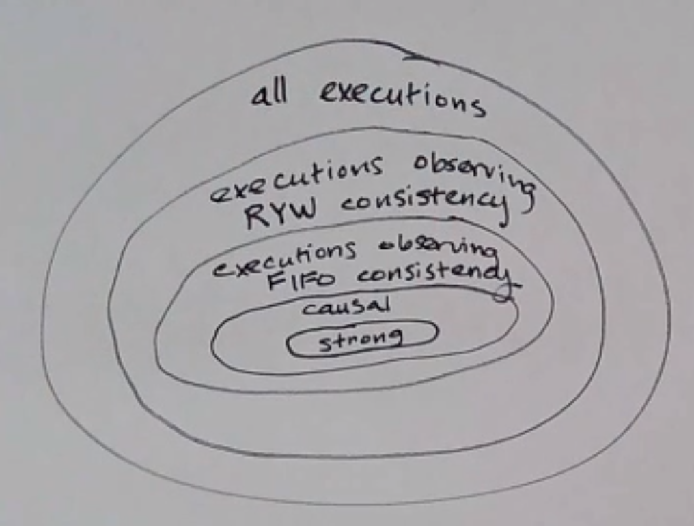

Replication
===========
Why do we replicate state/data?

- fault tolerance: prevent data loss
- data locality (keep data close to clients that need it)
- dividing the work

But:

- higher cost
- hard to keep state consistent

Informally, a replicated storage system is *strongly consistent* when you cannot tell that the data is replicated.

Primary-Backup Replication
--------------------------
First, pick a process to be the primary. All other processes are then backups. In this scenario, clients
can only connect to the primary

When a client makes a write to the primary, the primary sends that write to all backups - when it then receives
an ACK from all backups, that is the *commit point* and it returns OK to the client.

On a read, the primary just returns the value to the client without consulting with any backups.

.. note::
    The client must ask the *primary* instead of a backup because there might be an uncommitted write in flight -
    a backup might know it, but the primary might not have committed it yet.

How well does it match our replication criteria?

- [x] fault tolerance
- [ ] data locality
- [ ] dividing work

Chain Replication
-----------------
*Chain Replication for Supporting High Throughput and Availability* - van Renesse, Schneider, 2004

Writes go to the head, which forwards to the next one in the chain, and so on to the tail. The tail ACKs the write.

Reads go to the tail.

Well, how well does it do?

- [x] fault tolerance
- [~] data locality
- [x] dividing work
    - slightly better - reads and writes go to different processes

.. data:: throughput

    number of actions per unit of time

Depending on the workload, CR could give you better throughput than PB.

For CR, the optimal workload ratio is about 15% writes to 85% reads.

So what's the downside of CR? Well, CR has a **higher write latency** (depending on # of nodes in chain).
(the two have about the same read latency)

.. data:: latency

    time between start and end of one action

Since PB broadcasts the write, it's processed in parallel by the backups, and it can be ACKed as soon as all backups
ACK. For CR, the write message is forwarded, and has to be processed by each process in the chain in series.

.. note::
    Regardless of which replication scheme you choose, the client and replicas have to agree on who's the primary/
    head/tail/etc, or else you lose the guarantees of replication!

Total Order v. Determinism
--------------------------

Messages sent by different clients at the same time can arrive at different times:

In the second example, there's no violation of TO delivery, but the result is not the same depending on which client's
message receives first!

.. data:: determinism

    On every run, the same outcome is achieved.

Bad Things
----------
What happens if a client *can* tell that data is replicated (i.e. the replication is not strongly consistent)?

**Read-Your-Writes Violation**: A client's written is not immediately returned on a subsequent read.

**FIFO Consistency Violation**

.. data:: fifo consistency

    Writes done by a single process are seen by all processes in the order they were issued

**Causal Consistency Violation**

.. data:: causal consistency

    Writes that are related by happens-before (i.e. potentially causally related) must be seen in the same causal
    order by all processes

Consistency
-----------
Actually, we can define different **consistency models**:

(aside: a *model* is the set of assumptions you keep in mind when building a system)

But maintaining stronger consistency requires more work, which means more latency and just being harder! Remember,
replication/consistency usually involves duplicating messages too, so more bandwidth too

Coordination
------------
Going back to our strongly consistent replication protocols (PB/CR) - both of these need some kind of coordinator
process to know which process is the primary/head/tail/etc.

Chain Replication
^^^^^^^^^^^^^^^^^
CR uses the fail-stop fault model (i.e. crashes can occur and be detected by the environment), and requires that not
all processes crash. There are some ways to implement this (like heartbeating), but sometimes you'll have a false
positive.

- If the head process crashes, the coordinator makes the next process in line the new head
- If the tail process crashes, the coordinator makes the preceding process the new tail
- If a middle processes crashes, it just gets skipped over (although the clients do not have to be notified)

Additionally, when a failure happens, there has to be some handling of writes that are partway through the chain
when the failure happened - out of the scope of this class though (van Renesse & Schneider, 2004).

.. important::
    What if the coordinator fails?!?!?! Do we have to replicate the coordinator?

    (Next: Consensus)

