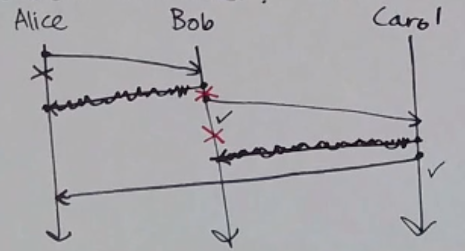

Safety & Liveness
=================

Previously:

- FIFO delivery
- Causal delivery
- Totally ordered delivery

These are all safety properties: properties that say a "bad" thing *won't* happen; on the other hand, a *liveness*
property says that a "good" thing *will* happen (e.g. eventual delivery).

.. note::
    The word *eventually* is often an indicator of a liveness property.

Now, formally:

.. data:: safety property

    - say that a "bad" thing won't happen
    - can be violated in a finite execution (can point to where it went wrong)

.. data:: liveness property

    - says that a "good" thing will (eventually) happen
    - cannot be violated in a finite execution (may take infinite time to satisfy)

It's the combination of safety and liveness that makes systems useful - for example, otherwise, you could just
drop every message to satisfy FIFO.

In fact, every property is either a safety property, a liveness property, or both.

Let's try and define reliable delivery:

(Take 1): Let :math:`P_1` be a process that sends a message to process :math:`P_2`. If neither :math:`P_1` not
:math:`P_2` crashes (and not all messages are lost), then :math:`P_2` eventually delivers *m*.

Well, it's a start, but the whole "not crashing" thing is weak.

Fault Models
------------
A *fault model* tells you which kind of faults can occur. In the example system of two processes, one asking the
other for a value, we have the following faults:

- message from :math:`M_1` is lost - omission fault
- message from :math:`M_1` is slow - timing fault
- :math:`M_2` crashed - crash fault
- :math:`M_2` is slow - timing fault
- message from :math:`M_2` is slow - timing fault
- message from :math:`M_2` is lost - omission fault
- :math:`M_2` lies - byzantine fault

.. data:: crash fault

    a process fails by halting (stops sending/receiving messages) and not everyone necessarily knows about it

    (There is actually a subset, called "fail-stop faults", where a process halts and everyone *knows* it halts)

.. data:: omission fault

    a message is lost (a process fails to send/receive a single message)

.. data:: timing fault

    a process responds too late (or too early)

.. data:: Byzantine fault

    a process behaves in an arbitrary or malicious way

    .. note::
        There's a subset of Byzantine faults between omission and Byzantine called "authentication-detectable Byzantine
        faults" - i.e. message corruptions that can be detected, and "downgraded" to an omission fault

If protocol X tolerates crash faults and protocol Y tolerates omission faults, does Y also tolerate crash faults?

Yes! Crash faults are just a special case of omission faults where *all* messages to/from a process are lost.

In fact, Byzantine faults are also a superset of crash (and omission) faults.

.. note::
    We left out timing faults in the above diagram, since we're dealing only in async in this class.

.. data:: fault model

    A *fault model* is a specification that says what kind of faults a system can exhibit, and this tells you what
    kinds of faults need to be tolerated.

In this class, we focus on the *omission model* (which includes the *crash model*).

Two Generals Problem
--------------------
*Tom Scott: https://www.youtube.com/watch?v=IP-rGJKSZ3s*

In the omission model, it is impossible for Alice and Bob to attack and know for sure that the other will attack.

How do we mitigate?

Probabilistic Certainty
^^^^^^^^^^^^^^^^^^^^^^^
One option is to have Alice constantly send until she receives an ACK; then the longer Bob
goes without receiving a message, the more sure he is that she has received the ACK. Note that it's not 100%
guaranteed; every single message since then could have failed, but it works.

Common Knowledge
^^^^^^^^^^^^^^^^
There is common knowledge of *p* when everyone knows *p*, everyone knows that everyone knows *p*, everyone knows that
everyone knows that everyone knows *p*...

Fault Tolerance
---------------
What does it mean to tolerate a class of faults? Usually it's defined by how/how much your program reacts to a fault.

A *correct* program satisfies both its safety and liveness properties, but often satisfying both is impossible
during a fault.

So really, it's about *how wrong* it goes in the presence of a fault.

+--------------+-------------+-----------+
|              | live        | not live  |
+==============+=============+===========+
| **safe**     | masking     | fail-safe |
+--------------+-------------+-----------+
| **not safe** | non-masking | :(        |
+--------------+-------------+-----------+

Reliable Delivery, Take 2
-------------------------
Previously: Let :math:`P_1` be a process that sends a message *m* to :math:`P_2`. If neither :math:`P_1` nor :math:`P_2`
crashes (and not all messages are lost), then :math:`P_2` eventually delivers *m*.

Do we need ``not all messages are lost``? Yes, if we're working under the omission model.

So how do we implement it?

One implementation: repeat until ack

- Alice puts a message in the send buffer
- on timeout, send what's in the buffer
- when ack received, delete message from buffer

One problem is if Bob's ACK gets dropped, and he receives the message twice. This may or may not be an issue, depending
on the message. For example, if the message is something like "increase value by 1", that's an issue!

.. note::
    Client A sending a set request, then client B, then a repeated send of client A is not actually an issue here -
    it's the same if client A's initial message was delayed (one client will be sad).

In this scenario, your messages should be *idempotent* - sending them multiple times should have the same effect
as if it was sent once.

So this is actually *at-least-once* delivery! But is *exactly-once* delivery possible?

Not really... most systems that claim exactly-once delivery in real life are one of the following:

- the messages were idempotent anyway
- they're making an effort to deduplicate messages on the receiver

Reliable Broadcast
------------------
*broadcast*: one sender, everyone receives

.. note::
    If you have a *unicast* primitive, you can implement broadcast by sending multiple unicasts in very quick
    succession.

.. data:: reliable broadcast

    If a *correct process* delivers a broadcast message *m*, then all correct processes deliver *m*.

    .. note::
        A correct process is a process that is acting correctly in a given fault model (e.g. not crashed in crash
        model).

**Ex**. If Alice sends a message to Bob and Carol in the crash model, Bob delivers it, but Carol crashes before she can,
reliable broadcast is not violated because Carol is not correct.

**Ex**. If Alice is sending a message to Bob and Carol in the crash model but crashes after Bob's is sent but before
Carol's is, reliable broadcast is violated, since Bob is a correct process that delivered the message, but Carol did
not.

If a process can crash in the middle of a broadcast, how do we get reliable broadcast?

If you receive a broadcast message, forward it to everyone else (or, at least, everyone but the sender) before
delivering it:

But if no one crashes, each process receives it twice:

But each process can keep track of messages they've already delivered/forwarded to not do it twice.

.. important::
    Fault tolerance often involves making copies!
