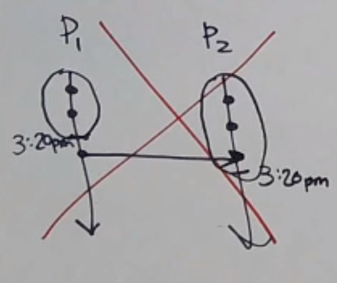
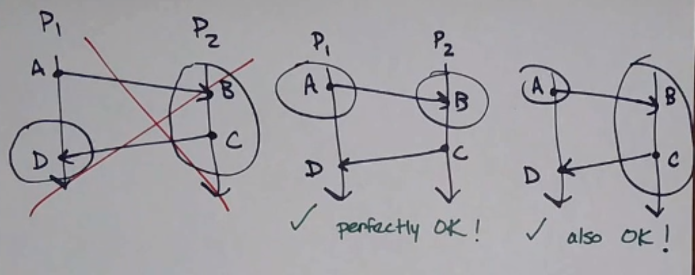
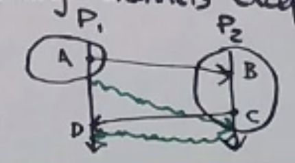
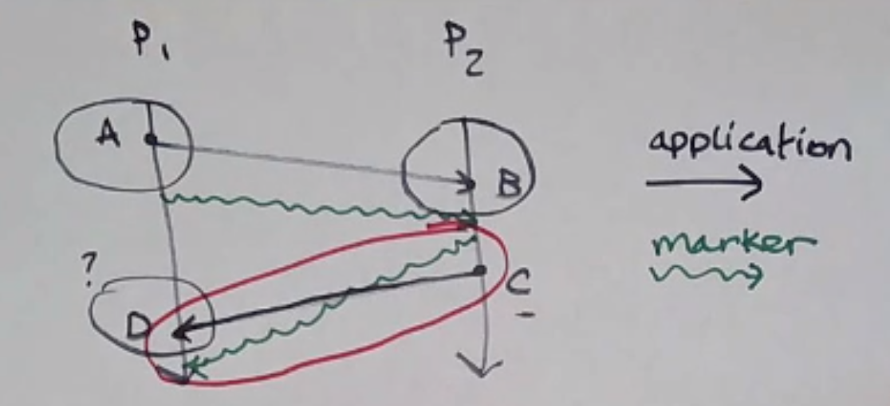
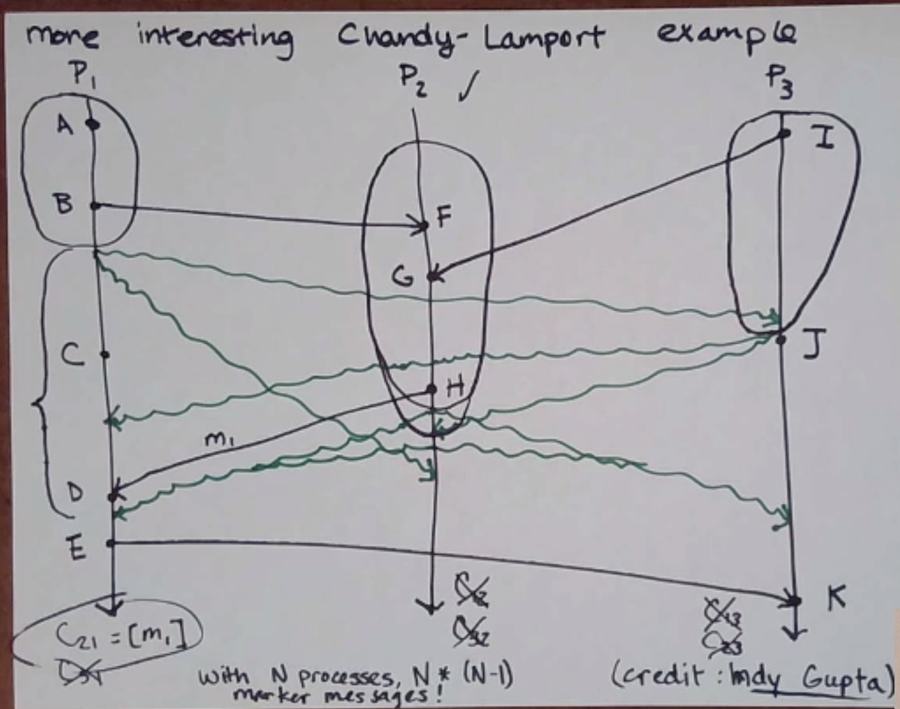

Snapshots of Distributed Systems
================================
Processes have individual *state*, which is pretty much all the events that have happened up to a given point.

How do we get the state of an entire distributed system (a "global snapshot") at a given time?

We can't use time-of-day clocks, since they aren't guaranteed to be synchronized across all processes.

.. data:: consistent

    **Property that we want**: If we have events *A* and *B* where :math:`A \to B`, and *B* is in the snapshot, then
    *A* is also in the snapshot.

Chandy-Lamport Algorithm
------------------------

.. data:: channel

    connection from one process to another, with FIFO ordering
    (e.g. :math:`C_{12}`: the channel from :math:`P_1` to :math:`P_2`)

    .. image:: _static/snapshot2.png
        :width: 250

    :math:`m_2` is *in* :math:`C_{21}`, :math:`C_{21}=[m_2, m_3]` (in-transit)

Note that a process graph must be *strongly connected* for C-L to work.

Some examples of snapshots:

How it works:

First, an initiator process (1 or more):

- records its own state
- sends a *marker message* out on all its outgoing channels
- starts *recording* the messages it receives on all its incoming channels

then, when process :math:`P_i` receives a marker message on :math:`C_{ki}`:

- if it is the first marker :math:`P_i` has seen (sent or received):
    - it records its state
    - marks channel :math:`C_{ki}` as empty
    - sends a marker out on all its outgoing channels
    - starts recording on all incoming channels *except* :math:`C_{ki}`
- otherwise:
    - it stops recording on channel :math:`C_{ki}`

^ this is a consistent snapshot!

^ Note that this cannot happen since channels are FIFO!

.. note::
    Since each process sends a marker message to every other message, this algorithm sends :math:`n(n-1)` messages
    in total.

The Big Picture
^^^^^^^^^^^^^^^
*in Chandy-Lamport Snapshots*

The bad:

- **channels** are required to be FIFO, and messages sent down them can be represented as an ordered list
  (e.g. :math:`C_{12}=[m_1, m_2]`)
- because channels are FIFO, you never have to pause applications sending messages
- C-L snapshotting also assumes you have *guaranteed delivery* (messages are not lost, corrupted, or duplicated)
- it also assumes that processes don't crash

The good:

- snapshots it takes are consistent, regardless of how long it takes to send the marker messages
- guaranteed to terminate (given assumptions above)
- works fine with more than one initiator! (decentralized - a centralized alg can only be initiated by one process)

Why?

- checkpointing
- deadlock detection
- detection of any *stable property*
