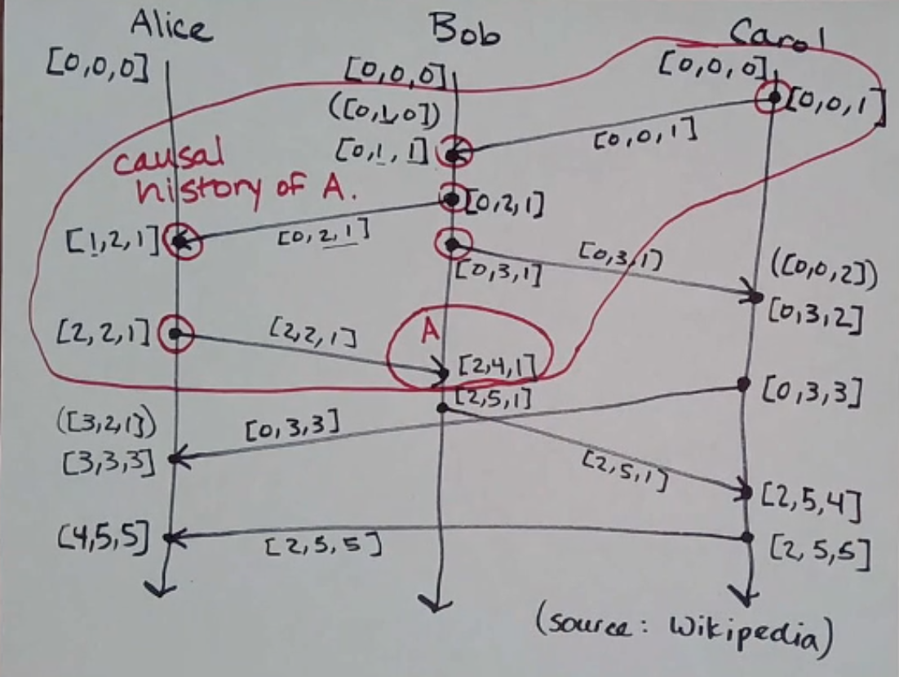

Time
====
What do we use clocks for?

- "scheduling": marking points in time
    - "this class starts at 3:20pm PDT"
    - "this item in cache expires on May 21 at 8pm"
    - "this error message in errors.txt has a timestamp of X"
- durations/intervals
    - this class is 95 minutes long
    - this request times out in 10 seconds

Computers have 2 kinds of *physical* clocks:

- time of day clock
    - tells you what time of day it is
    - can be synchronized between machines (e.g. NTP)
    - can jump forward/backward (e.g. moving between time zones, DST, leap seconds)
    - not so great for intervals/durations
    - *ok* for points in time, but only ok
- monotonic clock
    - only goes forward
    - not comparable between machines (e.g. time since boot)
    - cannot mark specific points in time

Consider the following scenario, where two computers take snapshots of their state at a given time:

.. image:: _static/time1.png
    :width: 500

Logical Clocks
--------------
Logical clocks only measure the *order of events*.

e.g. ``A -> B``: "A happened before B"

This tells us some things about causality:

- A *might* have caused B
- B *could not* have caused A

Lamport Diagrams
----------------
*aka spacetime diagrams*

Each process is represented by a line. It has a discrete beginning and goes on forever.

Events are represented by dots on the line.

You can represent systems of machines and messages with lines and arrows:

.. image:: _static/time3.png
    :width: 250

Given events *A* and *B*, we say :math:`A \to B` if:

- A and B occur on the same process with A before B
- A is a send event and B is the corresponding receive event
- :math:`A\to C` and :math:`C \to B`

If we can't be sure that given a pair of events, one happens before the other, they are *concurrent*:

:math:`R || T`

We can use logical clocks to counteract causal anomalies like this, caused by unbounded latency:

.. image:: _static/time4.png
    :width: 500

Network Models
--------------

.. data:: synchronous network

    a network where there exists an *n* such that no message takes longer than *n* units of time to be delivered.

    We won't talk about this type of network.

.. data:: asynchronous network

    a network with unbounded latency, i.e. there does not exist such *n* such that no message takes longer than *n*
    units of time to be delivered.

State and Events
----------------

.. data:: state

    something that a given machine knows - e.g. contents of memory/disk

    represented by a dot on a Lamport diagram

We can determine the current state by looking at the sequence of events leading up to it:

.. image:: _static/time6.png
    :width: 500

However, we can't do the opposite.

Partial Order
-------------
Let's take a brief detour to talk about partial orders.

Partial orders are:

- a set S
- a binary relation, often written ≤, that lets you compare elements of S, and has the following properties:
    - reflexive: :math:`\forall a \in S, a \leq a`
    - antisymmetry: :math:`\forall a, b \in S, a \leq b \land b \leq a \implies a = b`
    - transitivity: :math:`\forall a, b, c \in S, a \leq b \land b \leq c \implies a \leq c`

The "happens-before" relation is *not* a partial order! Considering a set of events, transivity holds and antisymmetry
holds (vacuously), but events are not reflexive!

.. note::
    An actual partial order is set containment:

    .. image:: _static/time7.png
        :width: 400

Note that in a partial order, some elements of S may not be comparable (in the example above, {A} and {B} are not
related). If all elements in S are comparable, it's called a *total order* (e.g. natural numbers).

Lamport Clocks
--------------
*a type of logical clock*

:math:`LC(A)` - the Lamport clock of event *A*.

.. data:: clock condition

    if :math:`A \to B`, then :math:`LC(A) < LC(B)`.

How do we assign Lamport clocks to events?

1. every process keeps a counter initialized to 0
2. on every event on a process, increment process' counter by 1
3. when you send a message, include the current counter with the message
4. when you receive a message, set counter to max(local, recv) + 1

.. important::

    The converse is not necessarily true (i.e. :math:`LC(A) < LC(B) \lnot \implies A \to B`).

    .. image:: _static/time9.png
        :width: 400

    Even though :math:`LC(A) < LC(B)`, there is no path from *A* to *B* - so there is no guarantee that :math:`A \to B`.

    Specifically, while Lamport clocks are *consistent* with causality, they do not *characterize* causaility.

    We can use it for it's contrapositive, though! (:math:`\lnot LC(A) < LC(B) \implies \lnot A \to B` 
    - either :math:`B \to A` or :math:`A || B`)

Vector Clocks
-------------
While Lamport clocks don't character causaility, vector clocks do!

:math:`A \to B \iff VC(A) < VC(B)`

1. Every process keeps a vector of integers initialized to 0 (size = # of processes)
2. On every event (including receive), a process increments its own position in its vector
3. When sending a message, a process includes its current vector clock
4. When receiving a message, a process updates its vector clock to max(local, recv) (element-wise) and increments its
   position

.. note::
    max() is element-wise: e.g. max([1, 12, 4], [7, 0, 2]) = [7, 12, 4]

Now, say we wanted to find all events that happened before some event *A* (its causal history):

Notice that all vector clocks of events in A's causal history are less than or equal to A's VC!
(Similarly, all events that happen after A have VCs greater than or equal to A's VC.)

Any events that do not satisfy either of these are concurrent with/causally independent of A.
(In the example above, some examples are ``[0, 3, 3]`` and ``[3, 3, 3]``).

.. note that images go to protocol here, up to time15
