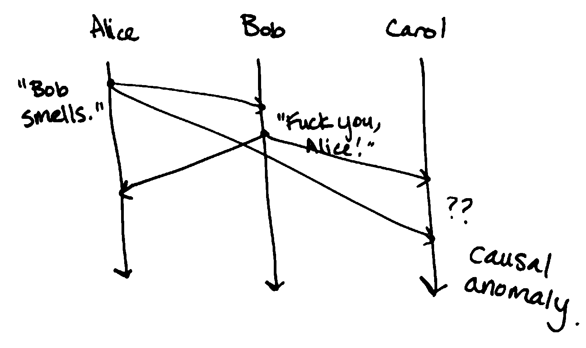

Time
====
What do we use clocks for?

- "scheduling": marking points in time
    - "this class starts at 3:20pm PDT"
    - "this item in cache expires on May 21 at 8pm"
    - "this error message in errors.txt has a timestamp of X"
- durations/intervals
    - this class is 95 minutes long
    - this request times out in 10 seconds

Computers have 2 kinds of *physical* clocks:

- time of day clock
    - tells you what time of day it is
    - can be synchronized between machines (e.g. NTP)
    - can jump forward/backward (e.g. moving between time zones, DST, leap seconds)
    - not so great for intervals/durations
    - *ok* for points in time, but only ok
- monotonic clock
    - only goes forward
    - not comparable between machines (e.g. time since boot)
    - cannot mark specific points in time

Consider the following scenario, where two computers take snapshots of their state at a given time:

Logical Clocks
--------------
Logical clocks only measure the *order of events*.

e.g. ``A -> B``: "A happened before B"

This tells us some things about causality:

- A *might* have caused B
- B *could not* have caused A

Lamport Diagrams
----------------
*aka spacetime diagrams*

Each process is represented by a line. It has a discrete beginning and goes on forever.

Events are represented by dots on the line.

.. image:: _static/time2.png
    :width: 250

You can represent systems of machines and messages with lines and arrows:

Given events *A* and *B*, we say :math:`A \to B` if:

- A and B occur on the same process with A before B
- A is a send event and B is the corresponding receive event
- :math:`A\to C` and :math:`C \to B`

If we can't be sure that given a pair of events, one happens before the other, they are *concurrent*:

.. image:: _static/time5.png
    :width: 500

We can use logical clocks to counteract causal anomalies like this, caused by unbounded latency:

Network Models
--------------

.. data:: synchronous network

    a network where there exists an *n* such that no message takes longer than *n* units of time to be delivered.

    We won't talk about this type of network.

.. data:: asynchronous network

    a network with unbounded latency, i.e. there does not exist such *n* such that no message takes longer than *n*
    units of time to be delivered.

State and Events
----------------

.. data:: state

    something that a given machine knows - e.g. contents of memory/disk

    represented by a dot on a Lamport diagram

We can determine the current state by looking at the sequence of events leading up to it:

However, we can't do the opposite.

